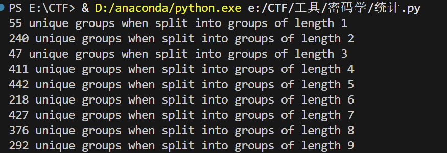
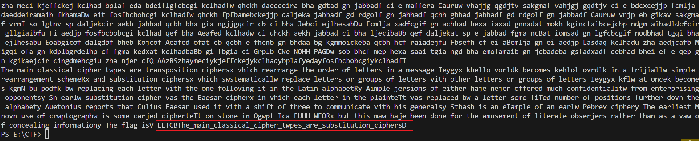
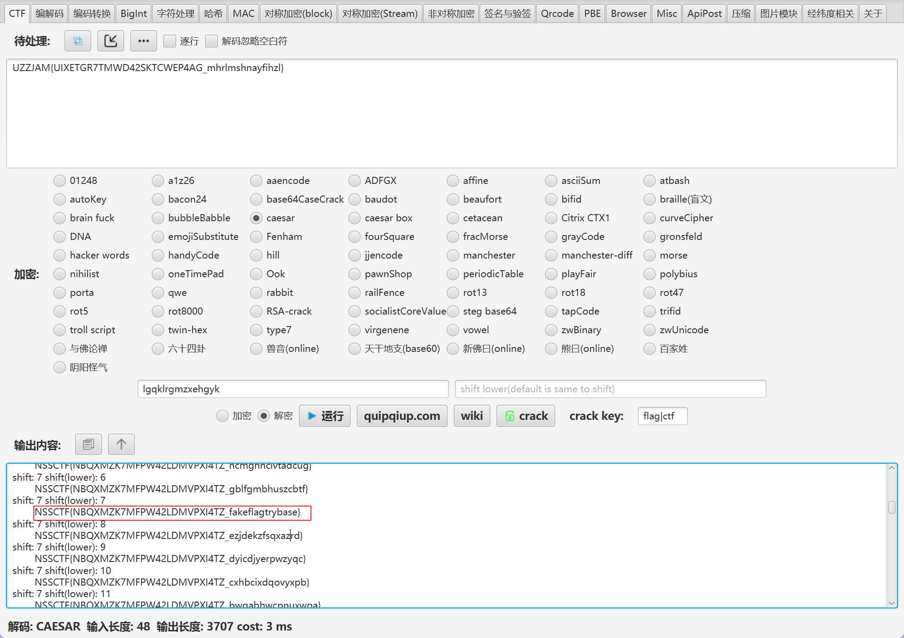
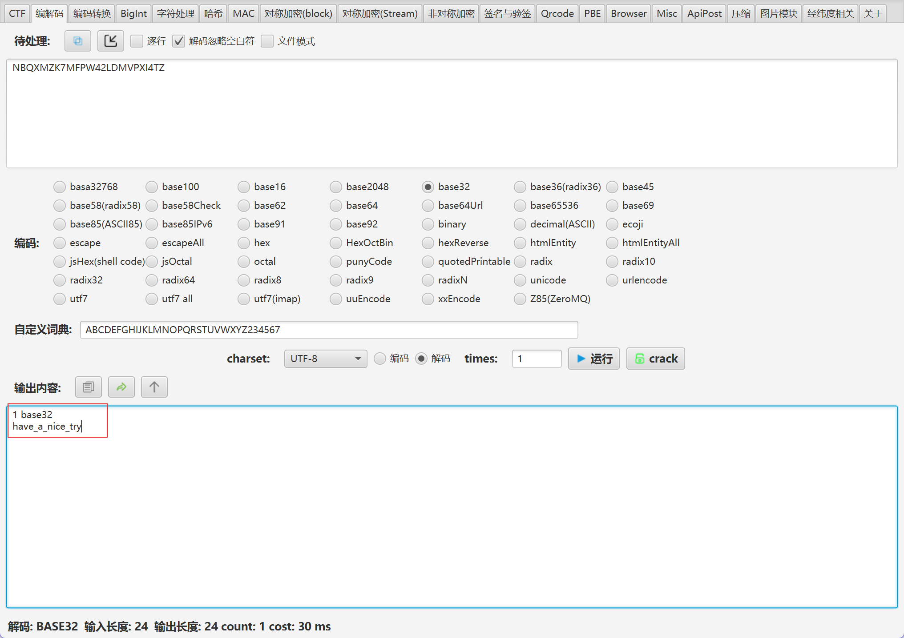
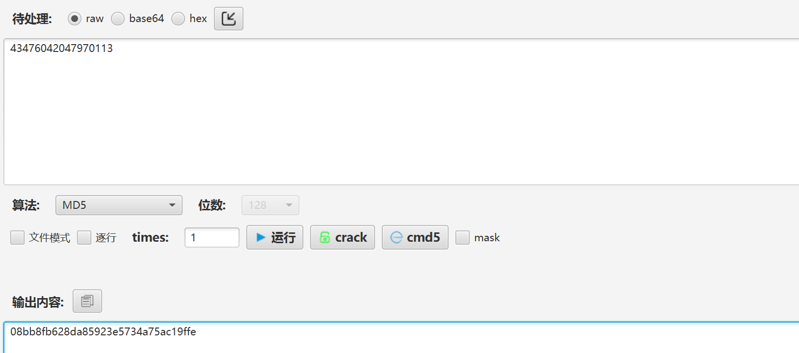

# CTF WP-CRYPTO
---
## [CryptoCTF 2020]Classic

https://www.nssctf.cn/problem/5537

* 考点：单字母密码，密文分析
* 工具：python


这道题一开始一直在根据5字组合求答案一直没找的规律，在搜索题解后发现是通过重构为3字组合后单字母替换,[参考答案](https://blog.cryptohack.org/cryptoctf2020)

密文原文如下：
```
b7UkM iK2L0 PUVnZ Ho79I tDAf0 PUvfQ G5jHo 7GwLG wL9It vfQHo 7G5j0 PUvfQ 9Ithd JkMiK 2LU2b 0PUkM B8Nih dJK2L GwL0P UHo7U 2bK2L 0PUkM BU2bH o7DAf GwLhd J9HJG wL9It kMB9I t9HJD Af0PU vfQ9I thdJk MiK2L U2bGw LfVK0 PUV2a kMi9I tvfQk Mi0PU U2bK2 LHo7U 2bU2b Ho7DA fFumK 2L0PU kMBkM iK2L0 PU9HJ U2bHL 1K2LU 2b0PU 9HJiG L0PUG 5jK2L kMBkM BK2LU 2bGwL 0PU9I tDAf0 PUHo7 0PUVn ZK2LG wLGwL Ho7Fu mK2L0 PUF5o K2LYR 5FumY R5fVK 0PUi7 OkMiK 2LG5j G5j9H J0PUV 2a9HJ U2bG5 jHL1i 7O0PU LN4K2 LvfQ9 HJVnZ K2LGw L0PUi 7OK2L kMiG5 j9HJG 5j0PU 9HJV2 aU2bH L1G5j i7O0P U9ItD Af0PU Ho70P UkMBU 2b9It vH99I tHo7G 5jG5j 8Ni0P UGwL9 ItVnZ hdJG5 jK2L0 PUU2b K2LHo 7U2bU 2bHo7 DAfFu mK2LV nZK2L DAfkM B0PUG wLvfQ kMiK2 LVnZK 2LqwU fVK0P UHo7D AfHL1 0PUGw LjiSL N4GwL kMB9I tkMBj iSkMB 9It9H JDAf0 PUvfQ 9Ithd JkMiK 2LU2b GwLfV K0PUV 2akMi 9Itvf QkMi0 PUGwL 8NiGw LkMBK 2LVnZ Ho7kM B9Itv fQHo7 G5jG5 j8Ni0 PUU2b K2Lhd JG5jH o7vfQ K2L0P UG5jK 2LkMB kMBK2 LU2bG wL0PU 9HJU2 b0PUF umU2b 9HJji ShdJG wL0PU 9HJiG L0PUG 5jK2L kMBkM BK2LU 2bGwL 0PUV2 a9Itk MBkMi 0PU9H JkMBk MiK2L U2b0P UG5jK 2LkMB kMBK2 LU2bG wL0PU 9HJU2 b0PUF umU2b 9HJji ShdJG wL0PU 9HJiG L0PUG 5jK2L kMBkM BK2LU 2bGwL 0PUF5 oK2LY R5Fum YR5fV K0PUi 7OiGL G5j8N i0PUH o7kMB 0PU9H JDAfv fQK2L i7O0P ULN4K 2LvfQ 9HJVn ZK2LG wL0PU i7OFu mVnZe V50PU LN4ji S0PUh dJ9HJ HL1iG Li7O0 PULN4 8Ni0P UU2bK 2LhdJ G5jHo 7vfQ9 ItDAf Fum0P UK2LH o7vfQ kMi0P UG5jK 2LkMB kMBK2 LU2b0 PUV2a 9ItkM BkMi0 PUkMB kMiK2 L0PU9 HJDAf K2L0P UiGL9 HJG5j G5j9H JV2a9 ItDAf Fum0P U9Itk MB0PU 9ItDA f0PUk MBkMi K2L0P UIAKH o7kMB 9ItDA f0PUH o7G5j hdJkM iHo7L N4K2L kMBqw UYR50 PU4BK 9ItVn ZhdJG 5jK2L 0PUvH 9K2LU 2bGwL 9It9H JDAfG wL0PU 9HJiG L0PUK 2L9It kMBkM iK2LU 2b0PU kMiHo 7vH9K 2L0PU DAfK2 LvH9K 2LU2b 0PU9H JiGLi GLK2L U2bK2 LHL10 PUVnZ jiSvf QkMi0 PUvfQ 9HJDA fiGL9 ItHL1 K2LDA fkMB9 ItHo7 G5j9I tkMB8 Ni0PU iGLU2 b9HJV nZ0PU K2LDA fkMBK 2LU2b hdJU2 b9ItG wL9It DAfFu m0PU9 HJhdJ hdJ9H JDAfK 2LDAf kMBGw LYR50 PUqAv DAf0P UK2LH o7U2b G5j8N i0PUG wLjiS LN4Gw LkMB9 ItkMB jiSkM B9It9 HJDAf 0PUvf Q9Ith dJkMi K2LU2 b0PUV 2aHo7 GwL0P UkMBk MiK2L 0PU6s bHo7K 2LGwL Ho7U2 b0PUv fQ9It hdJkM iK2LU 2bfVK 0PU9I tDAf0 PUV2a kMi9I tvfQk Mi0PU K2LHo 7vfQk Mi0PU G5jK2 LkMBk MBK2L U2b0P U9ItD Af0PU kMBkM iK2L0 PUhdJ G5jHo 79ItD AfkMB K2Lw8 tkMB0 PUV2a Ho7Gw L0PUU 2bK2L hdJG5 jHo7v fQK2L HL10P ULN48 Ni0PU Ho70P UG5jK 2LkMB kMBK2 LU2b0 PUGwL 9HJVn ZK2L0 PUiGL 9Itw8 tK2LH L10PU DAfji SVnZL N4K2L U2b0P U9HJi GL0PU hdJ9H JGwL9 ItkMB 9It9H JDAfG wL0PU iGLji SU2bk MBkMi K2LU2 b0PUH L19HJ V2aDA f0PUk MBkMi K2L0P UHo7G 5jhdJ kMiHo 7LN4K 2LkMB YR50P U4BKj iSK2L kMB9H JDAf9 ItjiS GwL0P UU2bK 2LhdJ 9HJU2 bkMBG wL0PU kMBkM iHo7k MB0PU c3Rji SG5j9 ItjiS GwL0P U6sbH o7K2L GwLHo 7U2b0 PUjiS GwLK2 LHL10 PU9It kMB0P UV2a9 ItkMB kMi0P UHo70 PUGwL kMi9I tiGLk MB0PU 9HJiG L0PUk MBkMi U2bK2 LK2L0 PUkMB 9HJ0P UvfQ9 HJVnZ VnZji SDAf9 ItvfQ Ho7kM BK2L0 PUV2a 9ItkM BkMi0 PUkMi 9ItGw L0PUF umK2L DAfK2 LU2bH o7G5j GwLYR 50PUq AvkMB LN4Ho 7GwLk Mi0PU 9ItGw L0PUH o7DAf 0PUK2 Lw8tH o7VnZ hdJG5 jK2L0 PU9HJ iGL0P UHo7D Af0PU K2LHo 7U2bG 5j8Ni 0PUe0 XK2LL N4U2b K2LV2 a0PUv fQ9It hdJkM iK2LU 2bYR5 0PUb7 UkMiK 2L0PU K2LHo 7U2bG 5j9It K2LGw LkMB0 PUOxr DAf9H JV2aD Af0PU jiSGw LK2L0 PU9HJ iGL0P UvfQU 2b8Ni hdJkM B9HJF umU2b Ho7hd JkMi8 Ni0PU 9ItGw L0PUG wL9HJ VnZK2 L0PUv fQHo7 U2bvH 9K2LH L10PU vfQ9I thdJk MiK2L U2bkM BK2Lw 8tkMB 0PU9H JDAf0 PUGwL kMB9H JDAfK 2L0PU 9ItDA f0PU2 Q3Fum 8Nihd JkMB0 PUF5o vfQHo 70PU2 cs8SC i4ai4 a0PUH 6J6sb 2Q3qw UfVK0 PULN4 jiSkM B0PUk MBkMi 9ItGw L0PUV nZHo7 8Ni0P UkMiH o7vH9 K2L0P ULN4K 2LK2L DAf0P UHL19 HJDAf K2L0P UiGL9 HJU2b 0PUkM BkMiK 2L0PU Ho7Vn ZjiSG wLK2L VnZK2 LDAfk MB0PU 9HJiG L0PUG 5j9It kMBK2 LU2bH o7kMB K2L0P U9HJL N4GwL K2LU2 bvH9K 2LU2b GwL0P UU2bH o7kMB kMiK2 LU2b0 PUkMB kMiHo 7DAf0 PUHo7 GwL0P UHo70 PUV2a Ho78N i0PU9 HJiGL 0PUvf Q9HJD AfvfQ K2LHo 7G5j9 ItDAf Fum0P U9ItD AfiGL 9HJU2 bVnZH o7kMB 9It9H JDAfY R50PU b7UkM iK2L0 PUiGL G5jHo 7Fum0 PU9It GwLf0 P0PU6 sb6sb b7U3g 7Berb 7UkMi K2LFP 1VnZH o79It DAfFP 1vfQG 5jHo7 GwLGw L9Itv fQHo7 G5jFP 1vfQ9 IthdJ kMiK2 LU2bF P1kMB 8Nihd JK2LG wLFP1 Ho7U2 bK2LF P1GwL jiSLN 4GwLk MB9It kMBji SkMB9 It9HJ DAfFP 1vfQ9 IthdJ kMiK2 LU2bG wL0wd 
```

可以发现其中有一些5字组合和其他的组合重复了，说明可能存在单字母替换，即每五个字符代表一个字符，但是经过统计发现其组合数太多，通过进一步划分，将原来的字符序列分为不同的组合，如2、3、4等组合后得到下面的规律：



可以看出在分组为4的时候组合数最少，那么在那个时候可能存在单字母替换

由此进行单字母替换，根据每一个组合出现的频率将不同的组合替换为特别的字符，然后再通过`SimpleSolver`得到最后的替换后输出字符




---

## [NSSCTF 2022 Spring Recruit]classic

https://www.nssctf.cn/problem/2077

* 考点：凯撒密码，base32解码
* 工具：base32，toolsfx

打开附件发现是一个关于古典密码学加密的文本（文件名提示），再加上文本的格式和flag的格式相似，联想到"NSSCTF"中有两个重复字母和这里的密文一致，所以基本可以确定是凯撒密码，解密后得到下面的结果：



由得到的内容可知还需要去尝试进行base解码，这里直接爆破，是base32解码，得到flag



---

## [SWPUCTF 2021 新生赛]ez_rsa

https://www.nssctf.cn/problem/431
  
* 考点：rsa加密，md5加密
* 工具：python，toolsfx

附件中同样是一个文本，指明了flag的内容，根据信息可以写出下面的代码求解:
```bash
from sympy import mod_inverse

def compute_rsa_private_key(p, q, e):
    """
    计算 RSA 私钥指数 d
    :param p: 素数 p
    :param q: 素数 q
    :param e: 公钥指数 e
    :return: 私钥指数 d, 以及计算过程中涉及的中间变量
    """
    # 计算 N
    N = p * q
    print(f"模数 N = {N}")
    
    # 计算欧拉函数 φ(N)
    phi = (p - 1) * (q - 1)
    print(f"欧拉函数 φ(N) = {phi}")
    
    # 计算 d（e 关于 φ(N) 的模逆元）
    d = mod_inverse(e, phi)
    print(f"私钥指数 d = {d}")
    
    return N, phi, d

# 给定 RSA 参数
p = 1325465431
q = 152317153
e = 65537

# 计算 RSA 私钥
N, phi, d = compute_rsa_private_key(p, q, e)
```

即求出了`d`的值，然后`md5`加密即可



---

常用函数解释：

下面给出一个总结，列举了 CTF 中常见的与密码学相关的函数和工具，这些函数往往构成了题目中加密、编码和混淆过程的基础模块：

1. **模幂运算和模逆运算函数**  
   - **pow(base, exp, mod)**：在 Python 中，经常用来实现 RSA 加密中的模幂运算，即计算 base^exp mod mod。  
   - **inverse(a, m)**：用于求解模逆运算，是 RSA 私钥生成中不可缺少的函数。

2. **大数生成与素数检测函数**  
   - **getPrime(bits)**：生成指定位数的素数，常用于 RSA、DH 等算法。  
   - **isPrime(n)**、**GCD(a, b)**：用来检测素数、计算最大公约数，为密钥生成和分解质因数等问题提供支持。

3. **填充（Padding）函数**  
   - **pad(data, block_size)** 与 **unpad(data, block_size)**：用于对明文数据进行填充，确保数据长度满足加密算法（如 AES、RSA 等）的要求（例如 PKCS#7 填充）。

4. **异或（XOR）操作函数**

   - **XOR**加密/解密：使用异或运算进行数据混淆。
5. **将字节串转换回整数**
   - bytes_to_long(FLAG)

6. **将整数转换回字节串**
   - long_to_bytes(FLAG_int)


**中国剩余定理**：


中国剩余定理是数论中一个非常重要的定理，其主要内容可以表述为：

**定理内容：**  
设有整数 \(n_1, n_2, \dots, n_k\)，如果它们两两互质（即任取 \(n_i\) 与 \(n_j\) 当 \(i \neq j\) 时，\(\gcd(n_i, n_j) = 1\)），那么对于任意给定的整数 \(a_1, a_2, \dots, a_k\)，同余方程组

\[
\begin{cases}
x \equiv a_1 \pmod{n_1}, \\
x \equiv a_2 \pmod{n_2}, \\
\quad \vdots \\
x \equiv a_k \pmod{n_k}
\end{cases}
\]

存在唯一的解，模 \(N = n_1 n_2 \cdots n_k\) 意味着所有解可以写成

\[
x = x_0 + tN,\quad t \in \mathbb{Z},
\]

其中 \(x_0\) 是一个特解。

**构造解的方法：**  
1. 计算 \(N = n_1 n_2 \cdots n_k\)。  
2. 对于每个 \(i\)，令 \(N_i = N / n_i\)。由于 \(n_i\) 与 \(N_i\) 互质，根据扩展欧几里得算法，可以找到一个整数 \(m_i\)，使得

   \[
   m_i N_i \equiv 1 \pmod{n_i}.
   \]

3. 令

   \[
   x = \sum_{i=1}^{k} a_i m_i N_i.
   \]

   则可以证明这个 \(x\) 满足所有的同余关系，即

   \[
   x \equiv a_i \pmod{n_i},\quad \text{对所有 } i = 1, 2, \dots, k.
   \]


## [SWPUCTF 2021 新生赛]crypto2

https://www.nssctf.cn/problem/413

* 考点：共模攻击,RSA,扩展的欧几里得算法
* 工具：python

本题为 RSA 的共模攻击，同一个模数 n 使用了不同的公钥对同一个明文进行了加密，可以使用扩展的欧几里得算法对其进行攻击，得到\[s_1 \times e_1+s_2 \times e_2=1\]（当e1和e2互质时），得到s1和s2的具体值后，最终的明文答案即为   \[(c1^{s1} \times c2^{s2}) \bmod n \equiv m^{s1 \times e1 + s2 \times e2} \bmod n \equiv m \bmod n\]

其中，代换了c1、c2为\[m^{s1 \times e1 + s2 \times e2} \]

脚本如下：

```python 
import libnum
import gmpy2

n = 103606706829811720151309965777670519601112877713318435398103278099344725459597221064867089950867125892545997503531556048610968847926307322033117328614701432100084574953706259773711412853364463950703468142791390129671097834871371125741564434710151190962389213898270025272913761067078391308880995594218009110313
e1 = 3247473589
e2 = 3698409173
c1=100156221476910922393504870369139942732039899485715044553913743347065883159136513788649486841774544271396690778274591792200052614669235485675534653358596366535073802301361391007325520975043321423979924560272762579823233787671688669418622502663507796640233829689484044539829008058686075845762979657345727814280
c2=86203582128388484129915298832227259690596162850520078142152482846864345432564143608324463705492416009896246993950991615005717737886323630334871790740288140033046061512799892371429864110237909925611745163785768204802056985016447086450491884472899152778839120484475953828199840871689380584162839244393022471075
def exp_def(e1,e2,c1,c2,n):
    s,s1,s2 = gmpy2.gcdext(e1, e2)
    m = (pow(c1,s1,n) * pow(c2 ,s2 ,n)) % n
    return int(m)

m=exp_def(e1,e2,c1,c2,n)
print(libnum.n2s(m))
```


## [watevrCTF 2019]Swedish RSA

https://www.nssctf.cn/problem/73

考点：多项式RSA，欧拉函数
工具：sagemath

