## 数字签名

|数字签名应具有的性质|
|:--:|
|签名可信|
|签名不可伪造|
|签名不可重用|
|签名文件不可改变|
|签名不可抵赖|

|数字签名两种方法|数字签名方案|
|:---:|:---:|
|对消息整体签名|直接数字签名|
|对消息摘要签名|仲裁数字签名|

### 直接数字签名
|对称体制|
|:-:|
|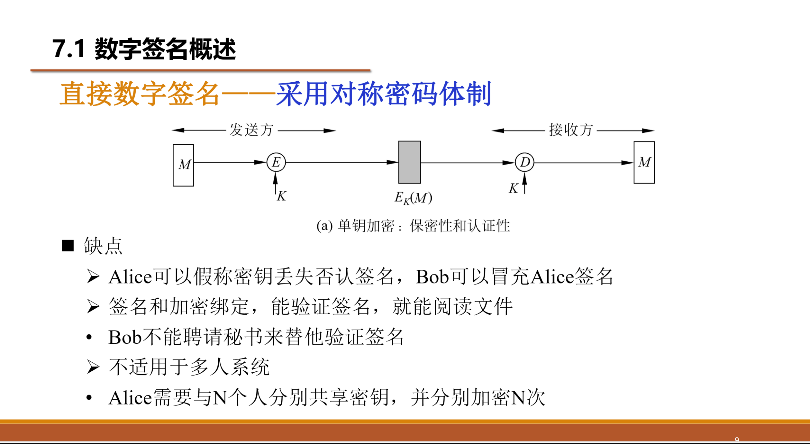|

|非对称体制|
|:-:|
|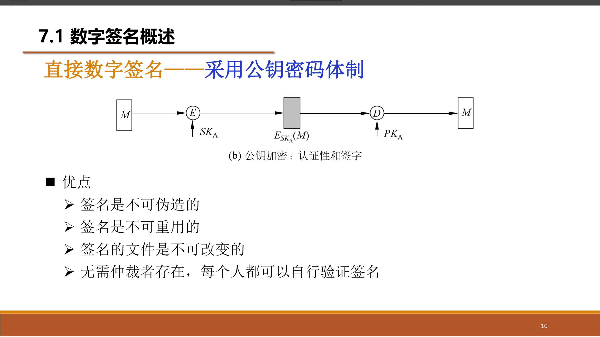|
|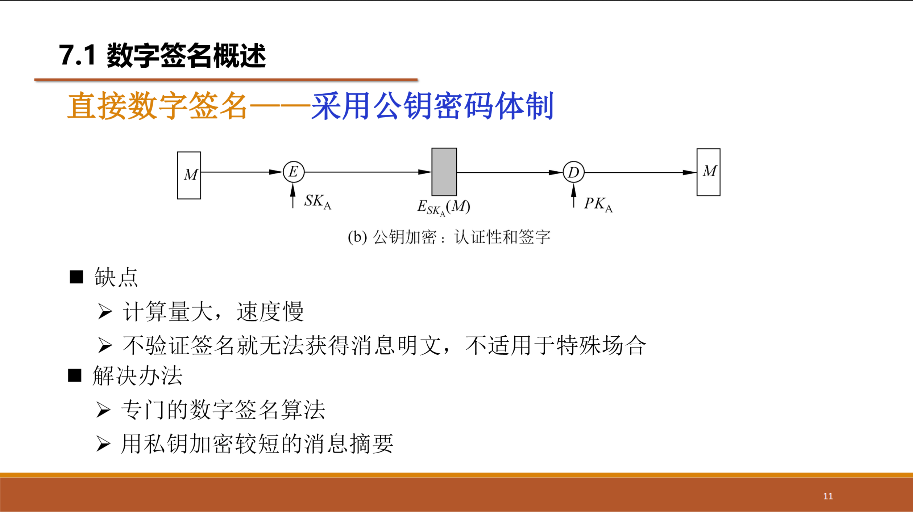|

### 仲裁数字签名
#### 由中间人A来进行验证和和转发，A分别与X、Y共享一个秘钥
#### Y无法直接获取到M的哈希值的
|对称体制|
|:-:|
||
|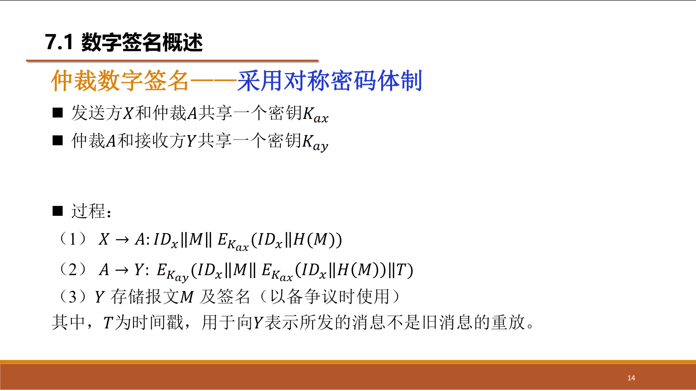|
|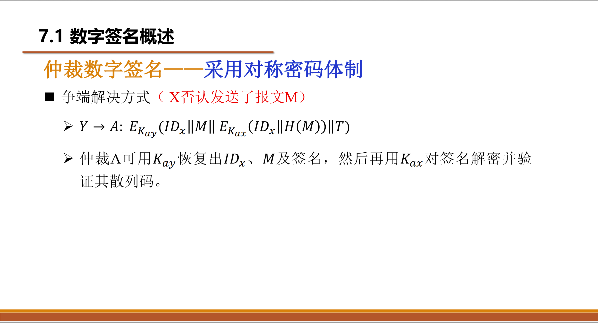|
|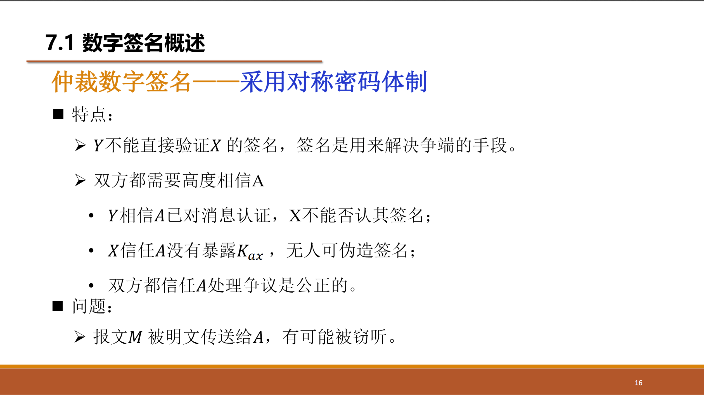|

|对称体制_另一种版本|
|:-:|
|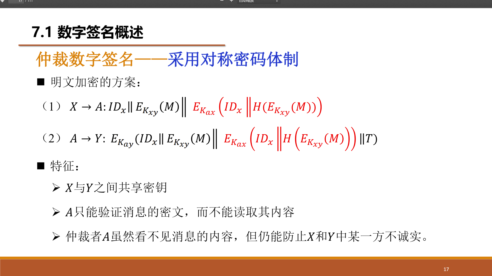|
||

|非对称体制|
|:-:|
|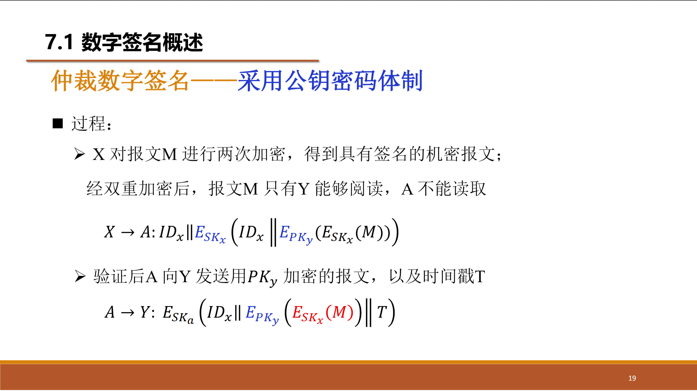|
|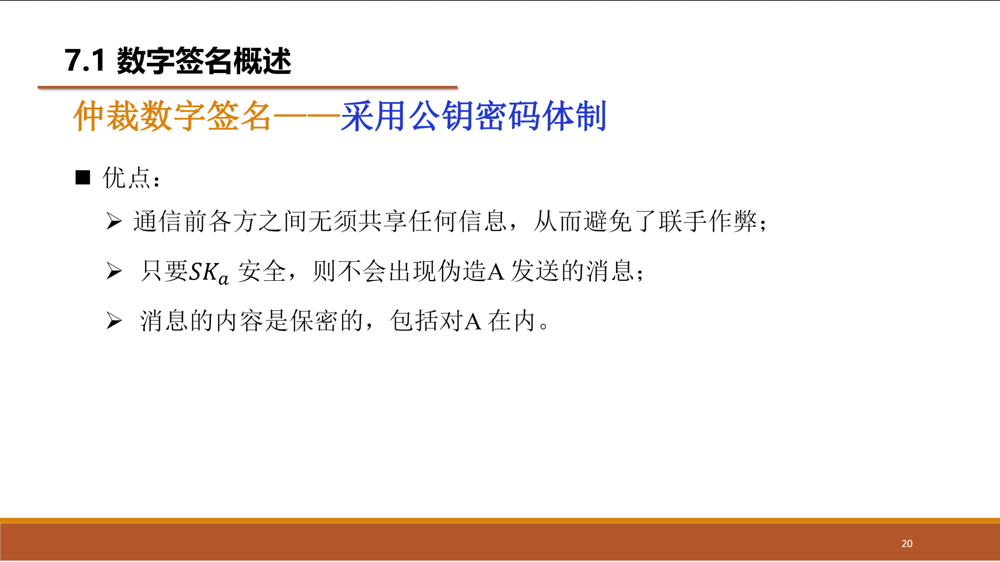|

### 针对数字签名的攻击
|攻击|
|:-:|
|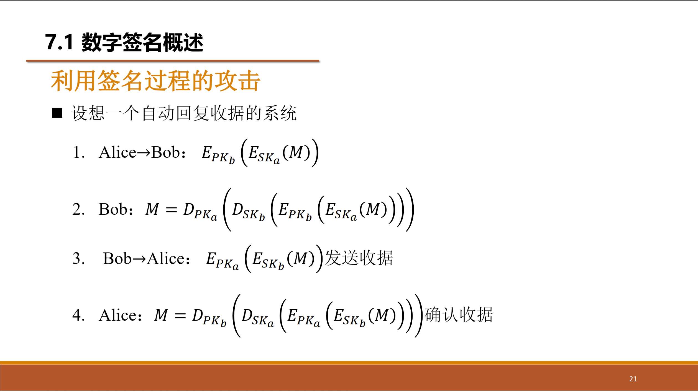|
|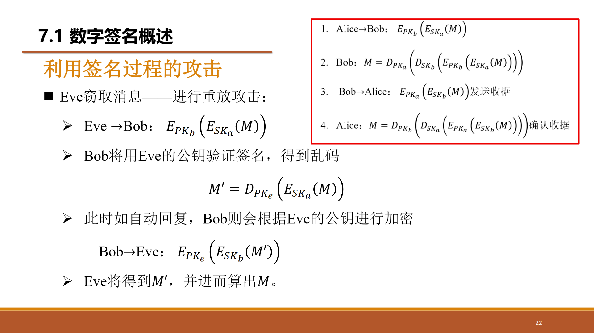|
