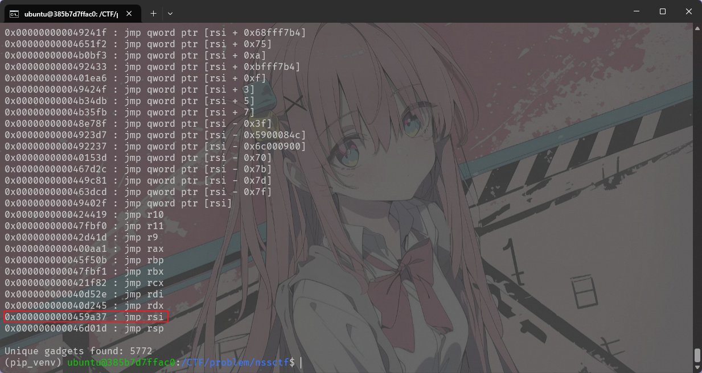

## ret2shellcode

没有开启NX 保护，可以直接在栈上注入并执行指令


使用
```sh
ROPgadget --binary service --only "jmp|rsi"
```

这条指令搜索`jmp rsi`的地址



`push_rsi_ret`的作用是让程序执行rsi所指向的地址的内容：
先将rsi的内容push入栈到rsp，然后执行ret，将rsp中的值弹给rip执行

`jmp_rsi`效果类似，也是将rsi的内容给到rip执行