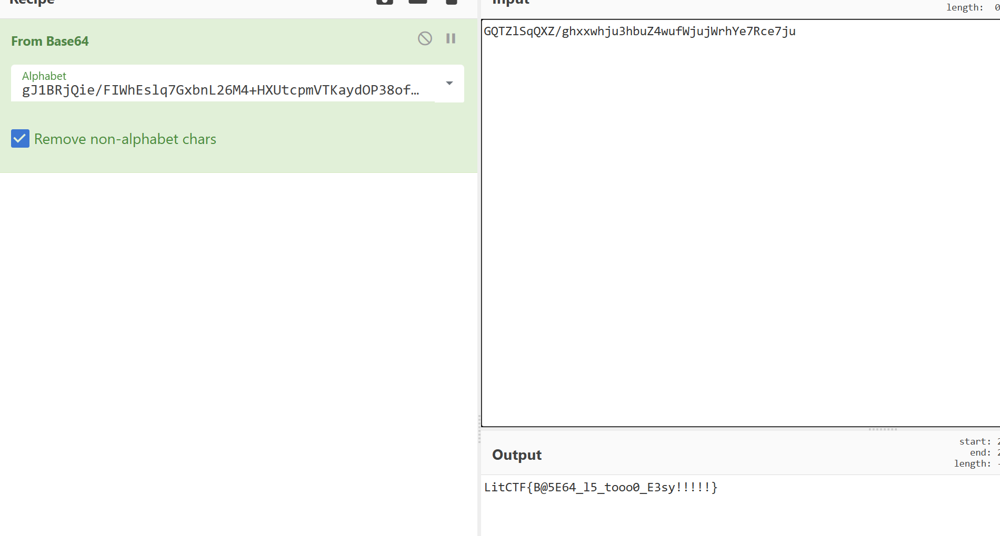

# CTF WP-Reverse

---

## [HUBUCTF 2022 新生赛]simple_RE

https://www.nssctf.cn/problem/2593

* 考点：base64替换表
* 工具：ida，python

通过反编译可以发现是一个对 base64 的值进行比较的程序，但是继续查看其中变量的内容会发现 base64 的表被替换了，所以要想正常的使用 base64 解出答案就需要将 base64 的表内容替换回去，使用下面的脚本实现：

```python
import base64
import string

str1 = "5Mc58bPHLiAx7J8ocJIlaVUxaJvMcoYMaoPMaOfg15c475tscHfM/8=="#编码后密文

string1 = "qvEJAfHmUYjBac+u8Ph5n9Od17FrICL/X0gVtM4Qk6T2z3wNSsyoebilxWKGZpRD" #自定义base加密表
string2 = "ABCDEFGHIJKLMNOPQRSTUVWXYZabcdefghijklmnopqrstuvwxyz0123456789+/"#原base64加密表

print(base64.b64decode(str1.translate(str.maketrans(string1,string2))))
```

---

常用函数：

- qmemcpy：类似于标准库中的 memcpy，qmemcpy 用于将指定字节数的数据从源地址复制到目标地址。
  
python 易错语法：
```python
Destination = Source.copy() # 直接赋值只是建立了指针，一个改变，另一个也会改变，使用copy()函数可以实现和c语言类似的效果
v3=[0]*65    v3=[none]*65
Source=list(Source) # 列表的初始化常用
<= or < # 注意看清循环的轮数，有没有等号
range(start:end) # 指定for循环的范围

```
---

## [LitCTF 2023]enbase64

* 考点：base64替换表，语言逆向
* 工具：python，ida

根据 ida 的结果可以发现，这个程序在 base64 这个函数中对 source 列表进行了修改，执行了 48 轮的迭代循环，得到了新的表，所以通过复现这一操作得到表即可解除flag



---

## [NISACTF 2022]string

https://www.nssctf.cn/problem/2042

* 考点：C，逆向技术，动态调试
* 工具：


## ida使用技巧：

- `shift+F12` 查看字符串
- 右键变量 交叉引用跟进 找到调用的相关位置，F5 可以直接查看反编译的代码


## 花指令

花指令又名垃圾代码、脏字节，英文名是 junk code 。花指令就是在不影响程序运行的情况下，往真实代码中插入一些垃圾代码，从而影响反汇编器的正常运行；或是起到干扰逆向分析人员的静态分析，增加分析难度和分析时间。